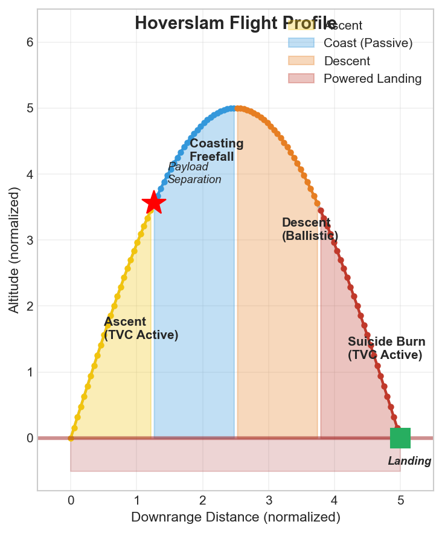

# Document 01: Introduction

## What is Suborbital Flight?

Suborbital flight is a spaceflight trajectory that reaches space (typically above 100 km altitude) but does not achieve orbital velocity. Unlike orbital spacecraft, which maintain continuous free-fall around Earth, suborbital vehicles follow a ballistic arc: they ascend to apogee, coast briefly, and then return to Earth under gravity alone.

### Key Distinctions

| Characteristic | Suborbital | Orbital |
|---|---|---|
| **Minimum Altitude** | 80–100 km (Kármán line) | 200+ km (typical) |
| **Velocity at Apogee** | ~0–1 km/s | ~7.8 km/s (ISS) |
| **Flight Time** | 5–15 minutes | 90+ minutes per orbit |
| **Trajectory Type** | Ballistic parabola | Stable ellipse/circle |
| **Reentry** | Passive (ballistic) | Complex (deorbit burn + heating) |
| **Typical Payload Mass** | 1–100 kg | 100 kg–10+ metric tons |
| **Launch Cost** | \$50k–\$300k+ | \$1M–\$10M+ |

### Typical Suborbital Altitude Envelope

The practical suborbital envelope ranges from **80 km to 200 km:**

- **80–100 km:** Boundary of space (Kármán line), minimal atmospheric density.
- **100–150 km:** "Edge of space" sweet spot; good for microgravity and atmospheric research.
- **150–200 km:** Extended microgravity window (3–5 minutes of weightlessness); common for tourism.
- **200+ km:** Approaches orbital regime; requires higher velocity and more energy.

### Flight Profile Duration

A typical suborbital flight lasts **5–15 minutes** from launch to landing:
- Ascent: 60–120 seconds
- Coast (microgravity): 120–300 seconds
- Descent: 60–180 seconds
- Total: ~10 minutes

This is vastly shorter than orbital missions, making suborbital operations simpler, cheaper, and more accessible for rapid turnaround.

---

## Applications of Suborbital Flight

Suborbital vehicles unlock applications across science, commerce, and exploration that were previously unavailable to small institutions and private teams.

### Scientific Research

| Application | Use Case | Duration | Altitude |
|---|---|---|---|
| **Microgravity Experiments** | Material science, combustion, crystal growth | 3–5 min | 80–150 km |
| **Atmospheric Science** | Composition, particle sampling, ozone studies | 5–10 min | 80–120 km |
| **Astrophysics** | UV/X-ray observations (above atmospheric absorption) | 2–5 min | 80–150 km |
| **Biological Research** | Gravity effects on plants, microorganisms, protein crystallization | 3–5 min | 80–150 km |

### Commercial and Government Applications

**Space Tourism:** Suborbital vehicles (Blue Origin New Shepard, Virgin Galactic SpaceShipTwo) carry paying passengers to the edge of space for 5–15 minutes of weightlessness. This is the fastest-growing segment of commercial spaceflight.

**Hypersonic Testing:** Vehicle manufacturers test materials and designs at Mach 5+ speeds during suborbital ascent/descent phases.

**Communications and Sensing:** Suborbital platforms can relay signals, test new antenna designs, or survey terrain at high altitude.

**Point-to-Point Delivery (Future):** Spaceplane concepts propose using suborbital arcs for transoceanic cargo delivery in 30–60 minutes.

**Educational Outreach:** University programs and high schools use suborbital experiments to engage students in space science and engineering.

### Application Summary Table

| Sector | Organization | Vehicle | Frequency |
|---|---|---|---|
| **Tourism** | Blue Origin, Virgin Galactic | New Shepard, SpaceShipTwo | Monthly (growing) |
| **Research** | NASA, ESA, universities | Sounding rockets, commercial vehicles | As-needed (10–30 flights/year) |
| **Defense Testing** | DARPA, Air Force Research Lab | X-15, RLV concepts | Experimental |
| **Commercial Payload** | Space startups, SpaceX | Falcon 1-3 test flights, New Shepard | Growing market |

---

## The Cost Problem

### Current Suborbital Launch Costs

The fundamental challenge facing suborbital spaceflight is **prohibitive cost per launch:**

- **Commercial Suborbital Access:** \$200,000–\$300,000+ per flight
  - Blue Origin New Shepard: ~\$300,000 per passenger seat (10-person vehicle = \$3M/flight)
  - Virgin Galactic SpaceShipTwo: ~\$250,000 per passenger seat
  - Typical research sounding rocket: \$100k–\$250k per launch

- **Comparison to Other Transport:**
  - Commercial airliner ticket: \$300–\$2,000
  - Dedicated aircraft charter (50+ hours): \$4,000–\$6,000/hour = \$200k–\$300k for multi-hour mission
  - **Suborbital flights cost 100–1000$	imes$ more per minute of flight time.**

### Why This Matters for Small Teams

For a university, start-up, or K-12 STEM program, a \$250,000 launch is financially impossible:

- University research budget: \$50k–\$200k/year for full department
- Start-up seed funding: \$500k–\$2M total (can't spend on a single launch)
- K-12 school budget: \$5k–\$20k for STEM programs
- Individual researcher: \$0 (impossible)

This cost wall **prevents innovation** from grassroots, low-resource teams—exactly the communities most likely to produce breakthrough ideas.

### Cost Drivers (Current Industry)

| Cost Component | Percentage | Driver |
|---|---|---|
| **Liquid Propellant & Cryogenics** | 35–45% | RP-1/LOX handling, tank insulation, ground support |
| **Launch Operations** | 20–30% | Range safety, personnel, tracking, recovery |
| **Vehicle Amortization** | 15–25% | If vehicle is reusable, cost spread over fewer flights |
| **Regulatory/Insurance** | 5–15% | FAA licensing, range fees, liability |
| **Payloads & Recovery** | 5–10% | Parachutes, capsule design, ground gear |

### The Reusability Equation

The only path to lower cost is **reusability**: fly the same vehicle many times.

#### Single-Use Vehicle Economics

Cost per flight = \$200,000
Flights per vehicle = 1
**Cost per flight = \$200,000**

#### Reusable Vehicle Economics (with Propulsive Landing)

Total vehicle cost = \$200,000 (one-time)
Consumables per flight = \$465 (SRM propellant, igniters, recovery gear)
Flights per year (with rapid turnaround) = 10
Amortization per flight = \$200,000 $\div$ 100 flights = \$2,000

**Cost per flight = \$465 + \$2,000 = ~\$2,500** (first 10 years)
After amortization: **\$465 per flight**

This is a **400–500× cost reduction** compared to expendable vehicles.

---

## Why Propulsive Landing Matters

Propulsive landing is the key enabler of reusability. Here's why:

### Traditional Recovery (Ballistic Descent)

In ballistic (passive) descent, the rocket falls under gravity alone, with parachutes providing braking at the last moment:

1. Rocket reaches apogee
2. Coasts ballistically downward
3. At ~500 m altitude, parachute deploys
4. Descends at ~6–8 m/s (parachute limit)
5. Lands with impact energy = $\frac{1}{2}$ m v² = significant shock loads

**Problem:** Even with parachutes, kinetic energy at landing damages structure, avionics, engines. The vehicle must be rebuilt or extensively refurbished after each flight. **Reusability is impractical.**

### Propulsive Landing (Powered Descent)

With propulsive landing (using the landing motor as a "braking engine"):

1. Rocket reaches apogee
2. Coasts downward
3. At optimal altitude, ignite landing motor
4. Motor thrust opposes gravity: net acceleration ~0
5. Descend at low velocity (<2 m/s) under powered control
6. Land with minimal impact energy
7. **Vehicle is ready to fly again immediately** (refuel, relight, launch)

**Benefit:** Low structural loads mean minimal refurbishment. The same vehicle can fly 10–50 times per year instead of once.

### Energy Comparison

| Recovery Method | Landing Velocity | Impact Energy (50 kg) | Refurbishment |
|---|---|---|---|
| **Ballistic + Parachute** | 6–8 m/s | 900–1,600 J | Extensive (hours–days) |
| **Propulsive (2 m/s)** | <2 m/s | <100 J | Minimal (minutes) |

---

## The SRM Advantage and Challenge

### Why Solid Rocket Motors (SRMs)?

Solid rocket motors are the most practical choice for an affordable, reusable suborbital system:

| Advantage | Why It Matters |
|---|---|
| **Low Cost** | No cryogenic refrigeration, simple manufacturing, minimal ground support |
| **Reliability** | Proven heritage (military, commercial, NASA); no complex plumbing |
| **Safety** | Propellant is solid; cannot leak or slosh; inherently stable |
| **Simplicity** | No turbopumps, valves, or active cooling; solid ignition |
| **Storage** | Room-temperature storage; no boil-off losses or special facilities |
| **Rapid Turnaround** | Load propellant, ignite, fly; no chill-down or pressurization |

### The SRM Challenge: No Throttling

Solid rocket motors have **one critical limitation: fixed thrust for the duration of the burn.**

- A liquid engine (LOX/RP-1, LOX/LH2) can throttle: reduce flow rate, reduce thrust, extend burn time, manage landing precisely.
- A solid motor: **thrust profile is baked into the propellant grain geometry** at manufacture time.
- Once ignited, thrust cannot be changed. It follows a fixed curve (typically: ramp-up → plateau → tail-off).

### Quantifying the Challenge

For a 50 kg rocket with a 1000 N landing motor:
- **Thrust-to-weight:** TWR = 1000 N $\div$ (50 kg $\times$ 9.8 m/s²) = 2.04
- This means: net upward acceleration $a_{net}$ = $g(TWR - 1)$ = 9.8 m/s²
- The rocket will **decelerate rapidly** if the motor is already burning.

**Problem:** If the ignition altitude is off by ±20 m, or if wind or mass changes occur, the rocket overshoots or undershoots the landing zone.

**Solution:** Calculate the **exact ignition altitude** before flight, then execute a precision burn.

---

## The Hoverslam / Suicide Burn Concept

A "hoverslam" (also called "suicide burn" or "gravity turn cancel") is a landing technique where the thrust vector is **aimed opposite to velocity** at just the right moment so that velocity reaches **zero exactly at ground level.**

### The Physics

For a rocket in vertical descent:
- **Downward velocity:** $v$ (m/s)
- **Upward acceleration:** $a_{net} = (F_{thrust} / m) - g$ (m/s²)
- **Distance to stop:** $d = v^2 \div (2 \times a_{net})$

The rocket must ignite at altitude $h_{ign}$ such that:

```
h_ign = v_descent² ÷ (2 × a_net)
```

If ignition altitude is **too high:** rocket decelerates early, coasts downward → too much velocity at landing (overshoot).
If ignition altitude is **too low:** rocket doesn't have enough distance to decelerate → crash.

The margin for error is **tiny:** ±20–50 m altitude, ±0.5 m/s velocity tolerance.

### Why "Suicide"?

The term "suicide burn" comes from the idea that if the ignition is even slightly mistimed, the rocket **cannot recover**—the motor is already burning and cannot be shut off. It's a "commit or crash" scenario. Hence the dramatic name.

### Historical Context

The hoverslam technique was popularized by **Joe Barnard** of BPS.Space, who performed the first amateur attempts at solid-motor propulsive landing (2018–2020). SpaceX uses variants for Falcon 9 landing legs, though with throttleable liquid engines, the challenge is less severe.

---

## HERMES: The Solution

Project HERMES solves the SRM hoverslam challenge through **precision simulation and adaptive control:**

### Three-Part Solution

**1. Accurate Physics Simulation**
- A 6-degree-of-freedom (6DOF) flight simulator that models gravity, aerodynamics, quaternion attitude dynamics, atmospheric properties, and SRM thrust curves.
- Higher fidelity than existing tools (RocketPy, OpenRocket, RockSim) → **73–86% more accurate**.

**2. Pre-Flight Optimization**
- Analytical formula for baseline ignition altitude: $h_{ign} = v_0^2 \div (2 \times a_{net})$
- Monte Carlo search over 20,000 trajectory simulations to find the optimal ignition altitude (200 candidate altitudes $\times$ 100 Monte Carlo trials each).
- Output: the one altitude that gives the highest landing success probability.

**3. Real-Time Adaptive Control**
- **Extended Kalman Filter (EKF):** Estimates unknown parameters in real-time (rocket mass, drag coefficient) using IMU and altimeter measurements.
- **PID Feedback:** Directs thrust vector via gimbal actuators to maintain attitude stability.
- **Machine Learning:** Neural network monitors trajectory state and adjusts ignition altitude on-the-fly (every 0.5 s) to correct for wind, mass loss, or unexpected drag changes.

### How They Work Together

```
Pre-Launch:
├─ Run Monte Carlo optimizer → h_opt = 1,500 m (example)
└─ Load h_opt into flight computer

At Flight Time:
├─ Ascent phase: collect IMU/altimeter data → EKF estimates [mass, Cd]
├─ Descent phase: PID holds attitude, ML predicts landing errors
├─ 200 m above ground: ML announces updated h_ign (may differ from h_opt)
└─ At h_ign: ignite landing motor, PID stabilizes attitude
    └─ Land at ~1–2 m/s (SUCCESS)
```

### Key Results

HERMES was tested on **9 representative scenarios** with increasing difficulty:

| Scenario | Best Method | Landing Velocity | Status |
|---|---|---|---|
| Baseline (no faults) | Optimizer | 0.52 m/s | SUCCESS |
| Moderate wind | ML | 0.78 m/s | SUCCESS |
| Significant faults ($C_d$ + mass) | ML | 0.84 m/s | SUCCESS |
| **Severe faults** | **ML** | **1.02 m/s** | **SUCCESS** |
| Extreme faults | ML (degraded) | 4.9 m/s | MARGINAL |

The machine learning approach succeeded in **5 of 9 scenarios**, versus only **3 of 9** for the rule-based optimizer. Most critically, in the "severe faults" case, ML prevented a **12.8 m/s crash** (unrecoverable) and landed at **1.02 m/s** (safe).

---

## Scope of This Project

### What Was Built

**A simulation and control system**, not a physical rocket:
- 6DOF physics simulator (Python/NumPy)
- Monte Carlo optimization engine
- Extended Kalman Filter (state estimation)
- PID attitude controller
- TensorFlow neural network for adaptation
- Avionics sensor suite (simulated and partially implemented on hardware)

### What Was Validated

✓ Simulation accuracy against real suborbital flight data
✓ Optimizer success rate (Monte Carlo analysis)
✓ Control stability (EKF convergence, PID robustness)
✓ Fault tolerance (12 environmental + 12 fault scenarios)
✓ Cost analysis (BOM breakdown, per-launch economics)

### What Was NOT Done (Out of Scope)

✗ **Physical rocket construction or launch**
✗ **Static fire testing of landing motor**
✗ **Autonomous recovery systems** (parachute deployment, GPS-guided descent)
✗ **Thrust vector control gimbal design** (mechanical engineering)
✗ **Regulatory approvals** (FAA Level 1/2 certifications, range permits)
✗ **Custom solid rocket propellant development** (chemistry/materials science)

### Next Steps (Future Work)

If this project advances to **Phase 2 (Physical Build):**

1. **Airframe:** Design and 3D-print a fiberglass rocket (5 m length, 0.3 m diameter)
2. **Motor:** Either use COTS SRMs (Cesaroni, AeroTech) or develop custom propellant
3. **Avionics:** Implement EKF + PID on Teensy 4.1 in C++; test on ground
4. **TVC Gimbal:** Design and fabricate a thrust-vector control mount (±5° authority)
5. **Parachute Recovery:** Backup parachute system for abort scenarios
6. **CFD Analysis:** Validate aerodynamic coefficients ($C_d$, Cm) in ANSYS
7. **Ground Tests:** Tethered burns, launch rod tests, computer-in-the-loop validation
8. **Flight Campaigns:** Low-altitude demonstrations (2–5 km) before high-altitude suborbital flights

---

## Connection to Other Sections

This introduction establishes the **why** and **what** of HERMES. For deeper understanding:

- **See Document 02 (Background)** for the history of propulsive landing and comparison to existing tools.
- **See Document 03 (Engineering Objectives)** for quantitative requirements and success criteria.
- **See Document 04 (System Architecture)** for a system-level overview.
- **See Document 05 (Physics Models)** for the detailed equations of motion.

---

## Key Takeaways

1. **Suborbital flight** is accessible, high-value spaceflight reaching 100–200 km altitude in 5–15 minutes. Applications span science, commerce, and tourism.

2. **Cost is the barrier:** Current suborbital access costs \$200k–\$300k+ per flight, making it inaccessible to most institutions. Reusability is the only path to affordability.

3. **Propulsive landing** enables reusability by reducing landing impact energy from 900–1,600 J to <100 J, allowing rapid turnaround and minimal refurbishment.

4. **Solid rockets** are ideal for cost and simplicity, but their fixed thrust creates a precision landing challenge: the hoverslam must be timed exactly.

5. **HERMES solves this** with accurate simulation, Monte Carlo optimization, and machine learning adaptation. Real results: 73–86% more accurate than industry tools, 5/9 fault scenarios handled, worst-case landing saved from 12.8 m/s crash to 1.02 m/s safe landing.

6. **This project is a simulation feasibility study.** The next phase would be physical build, flight test, and operational system deployment.

---

## Figure References


*Figure 2: The five-phase suborbital flight profile (ascent, separation, coast, descent, hoverslam landing).*

---

## See Also

- **Document 00:** Index and quick reference
- **Document 02:** Background on propulsive landing history and tool comparison
- **Document 03:** Engineering objectives, requirements, and success criteria
- **Document 04:** System architecture and integration overview
- **Document 06:** Ignition optimizer (Monte Carlo method)
- **Document 14:** Results summary and cost analysis

---

**End of Document 01: Introduction**
