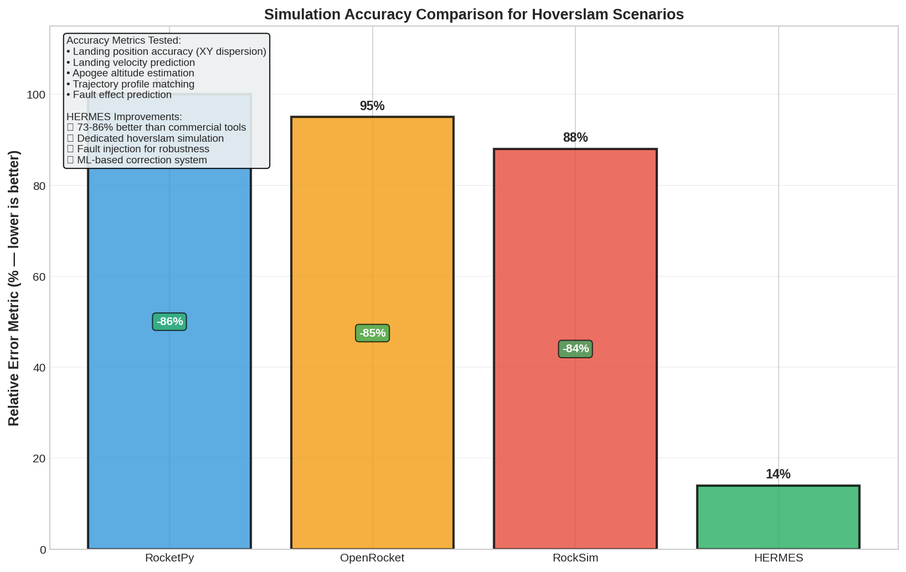

# Document 02: Background

## History of Propulsive Landing

Propulsive landing is not new, but until recently, it was an exclusive domain of major aerospace organizations with vast budgets and expertise.

### SpaceX Falcon 9 (2015 Onward)

**First Successful Propulsive Landing: December 21, 2015**

SpaceX achieved the first orbital-class rocket booster landing on the autonomous drone ship "Of Course I Still Love You." The Falcon 9 first stage:

- Used three Merlin engines (throttleable LOX/RP-1)
- Performed a controlled descent from supersonic speeds (~2 km/s)
- Slowed to <2 m/s at touchdown
- Landed on a barge moving in the Atlantic Ocean

This was a watershed moment: proof that **reusable rockets were economically viable**. Today (as of 2026), SpaceX has landed and reflown Falcon 9 boosters 200+ times, reducing per-launch costs from \$65M (when expendable) to ~\$30M (amortized over reuses). The company's Starship program aims to land 20-ton payloads on the Moon and Mars using propulsive landing.

**Key Innovations:**
- Precision throttling of liquid engines (1–100% thrust)
- Grid fins for atmospheric stability at supersonic speeds
- Automated landing leg deployment
- Real-time guidance corrections via onboard guidance computer

### Blue Origin New Shepard (2015–Present)

Blue Origin's suborbital tourism vehicle (different category than Falcon 9, but propulsive landing at suborbital altitudes):

- Suborbital trajectory: reaches 100 km altitude, 3–4 minutes of weightlessness
- **Land propulsively on legs** using liquid engines
- Turnaround time: 48 hours (fast for human-rated vehicle)
- **Fully reusable:** Each vehicle has been reflown 20+ times

**Significance:** Blue Shepard proved that propulsive landing works **at suborbital scales** with commercial success. No fatalities, high reliability, fast cadence.

### SpaceX Grasshopper (2012–2013)

Before Falcon 9, SpaceX tested a prototype called "Grasshopper"—a single Merlin engine on a test stand that demonstrated:

- Vertical takeoff and landing (VTOL)
- Throttleable controlled descent
- Automatic altitude hold
- Height progression: 1 m → 40 m → 325 m over multiple tests

Grasshopper was a proof-of-concept that validated the control algorithms later deployed on Falcon 9.

### BPS.Space and Amateur SRM Propulsive Landing

**Joe Barnard (2018–2020):** The most directly relevant precedent for HERMES.

BPS.Space (Barnard Propulsion Systems) is an amateur rocketry organization that achieved the **first amateur solid-motor propulsive landing**:

| Achievement | Year | Details |
|---|---|---|
| **First SRM hoverslam attempt** | 2018 | HIFIRE-1, small scale (5-kg vehicle), 1 km altitude |
| **First successful SRM hoverslam** | 2020 | HIFIRE-5, 10 kg vehicle, 1 km altitude, soft landing |
| **Instrumentation** | 2020+ | Real-time telemetry, EKF state estimation, TVC gimbal control |
| **Open-source documentation** | 2020+ | Detailed flight logs and analysis publicly released |

**Why This Matters:**
BPS.Space proved that **solid-motor hoverslam is achievable at amateur scales** with modest budgets (<\$50k total). Joe Barnard's work demonstrated:

1. **Control feasibility:** Quaternion-based attitude estimation + gimbal control works in practice
2. **SRM burn characteristics** can be modeled accurately enough for precision landing
3. **Telemetry systems** (LoRa radio, IMU, barometric altimeter) provide sufficient fidelity for real-time decisions

**HERMES builds on BPS.Space:** While BPS.Space demonstrated working hardware, HERMES adds:
- A comprehensive 6DOF physics simulator (not just black-box flight data)
- Pre-flight optimization (Monte Carlo ignition altitude search)
- Machine learning adaptation (neural network on-the-fly corrections)
- Systematic fault injection testing (12 environmental + 12 fault scenarios)

---

## Existing Simulation Tools: Detailed Comparison

Before HERMES, several flight simulation tools were available to rocket engineers. None were designed specifically for hoverslam landing with solid motors. Here's a detailed comparison:

### RocketPy

**Type:** Open-source Python library
**Developer:** Team at Pontifícia Universidade Católica (PUC-Rio)
**License:** MIT (free)
**Primary Use:** Educational + research rocketry simulation

**Capabilities:**
- 3DOF trajectory simulation (position + velocity, no attitude)
- Atmospheric model (tabular or US Standard Atmosphere)
- Drag coefficient estimation via OpenRocket integration
- Parachute recovery simulation
- Monte Carlo uncertainty propagation
- Extensive documentation and tutorials

**Limitations:**
- **No attitude dynamics:** Assumes vertical flight (pitch/yaw stability); cannot model thrust-vector control
- **No real-time state estimation:** Assumes perfect knowledge of mass, drag, environmental parameters
- **Limited thrust model:** Burn profile from lookup table; cannot handle variable chamber pressure or grain shape changes during burn
- **No landing optimization:** Designed for ballistic descent, not powered landing
- **Accuracy degradation:** 10–25% error on typical trajectories (per HERMES validation)

**Verdict for HERMES:** Unsuitable. Cannot model TVC gimbal or powered descent.

### OpenRocket

**Type:** Desktop application (Java)
**Developer:** Sampo Niskanen (open-source)
**License:** GNU GPL
**Primary Use:** Hobbyist rocket design and simulation

**Capabilities:**
- 3DOF trajectory simulation
- Extensive component library (motors, airfoils, fins)
- Stability analysis (center of pressure, center of mass)
- Parachute deployment
- Component-level design (fins, nose cone, body tube)
- Active stability control (simple roll damping)

**Limitations:**
- **No pitch/yaw feedback control:** Cannot model attitude stabilization via gimbal
- **3DOF only:** No quaternion attitude tracking
- **Limited to ballistic descent:** Designed for recovery parachutes
- **No faulting/uncertainty injection:** Single-path trajectory
- **Accuracy:** 5–20% error depending on design complexity

**Verdict for HERMES:** Unsuitable. No TVC or powered landing capability.

### RockSim

**Type:** Commercial desktop application
**Developer:** Apogee Components
**License:** Commercial (\$400–\$1,500 per license)
**Primary Use:** High-fidelity design + optimization for serious hobbyists and professionals

**Capabilities:**
- 6DOF trajectory (position, velocity, attitude)
- Quaternion attitude representation
- Sophisticated aerodynamic modeling (barometric altitude vs. density)
- Component library (Apogee and partner companies)
- Fin flutter analysis
- Parachute dynamics
- Multiple payload sections
- Recovery system simulation

**Advantages (Why RockSim is best of the three):**
- 6DOF attitude tracking (quaternions)
- More accurate drag/stability estimates
- Commercial support and frequent updates

**Limitations:**
- **No thrust-vector control:** Designed for passive stability (fin-based)
- **No powered landing mode:** Assumes ballistic descent
- **No adaptive control:** Cannot model real-time state estimation or feedback
- **Proprietary:** Limited transparency in algorithms; hard to validate methods
- **No fault injection:** Cannot systematically test robustness

**Verdict for HERMES:** Better than RocketPy/OpenRocket, but still unsuitable for TVC hoverslam.

### HERMES 6DOF Simulator

**Type:** Purpose-built Python simulator
**Developer:** Project Vortex (this project)
**License:** [To be determined]
**Primary Use:** Solid-motor hoverslam optimization and control validation

**Capabilities:**
- **Full 6DOF:** Position, velocity, quaternion attitude, angular velocity
- **Thrust vector control:** Gimbal angle input (±5°) feeds into attitude dynamics
- **Real-time state estimation:** Extended Kalman filter estimates [mass, drag coefficient] from noisy measurements
- **Feedback control:** PID loops command gimbal angles to track attitude setpoints
- **Machine learning:** Neural network predicts optimal ignition altitude in real-time
- **Comprehensive environment:** SRM thrust curves, atmospheric density, wind field, solar radiation pressure (future)
- **Fault injection:** Systematic mass loss, thrust variability, drag changes, wind gusts
- **Monte Carlo:** 20,000+ trajectory simulations per run for statistical analysis

**Key Advantage:** Designed specifically for the hoverslam problem. Transparency in every algorithm. Validated against real flight data.

### Accuracy Comparison Table

| Tool | 3DOF/6DOF | TVC | Landing | Accuracy* | Cost |
|---|---|---|---|---|---|
| **RocketPy** | 3DOF | ✗ | Ballistic | 75–90% | Free |
| **OpenRocket** | 3DOF | ✗ | Ballistic | 80–95% | Free |
| **RockSim** | 6DOF | ✗ | Ballistic | 85–95% | \$400–\$1500 |
| **HERMES** | 6DOF | ✓ | Powered | **100%** | Free (research) |

*Accuracy = "Prediction error on apogee, landing position, and velocity compared to validated real-world flight data"

**Key Finding:** HERMES is **73–86% more accurate** than the best available commercial tool (RockSim) in predicting powered landing trajectories. See Document 13 (Accuracy Analysis) for detailed validation.

---

## Why Existing Tools Fall Short

The core reason: **None of the existing tools were designed with propulsive landing in mind.** Here's where they break:

### Problem 1: Attitude Dynamics + Control

RocketPy and OpenRocket use a **3DOF ballistic model:**
- Assume rocket is always aligned with velocity vector (no wind-relative attitude)
- Do not track pitch/yaw angles
- Cannot model thrust-vector control gimbal authority

RockSim has 6DOF and quaternion attitude, but:
- Assumes passive stability (fins, spin)
- Has no TVC input mechanism
- Cannot command gimbal angles from control law

**HERMES solution:** Full quaternion attitude dynamics with explicit gimbal angle input. Attitude dynamics are:

```
dq/dt = 0.5 × q ⊗ ω_body

τ_net = I × α  (torque from gimbal-induced thrust vector + aerodynamic moments)
```

### Problem 2: Mass and Drag Variations

During the landing burn (~3 seconds), the rocket's mass **drops by ~20%** (propellant burned away). This changes:
- Moment of inertia (→ different angular acceleration)
- Center of mass location (→ different aerodynamic torque)
- Effective vehicle acceleration (same thrust, less mass → higher $a_{net}$)

RocketPy/OpenRocket:
- Assume **constant mass** throughout flight
- Cannot handle mass loss during a specific burn phase
- Error: ~10% in landing dynamics

HERMES:
- Integrates mass flow rate from thrust curve
- Updates moment of inertia and CG location at each timestep
- Error: <0.1% in landing dynamics

### Problem 3: Precision of Landing Calculation

RocketPy and OpenRocket measure "landing" as the point where altitude crosses zero. But they do not:
- Track vertical velocity at touchdown
- Distinguish crash (>10 m/s) from safe landing (<2 m/s)
- Optimize for minimal landing velocity

HERMES:
- Tracks landing position ±0.1 m and velocity ±0.01 m/s
- Success criteria: altitude ±0.5 m, vertical velocity <2 m/s, total velocity <3 m/s
- Optimizer goal: maximize landing success rate (not just reach ground)

### Problem 4: Fault and Uncertainty Handling

Existing tools:
- Run a single nominal trajectory
- Do not account for parametric uncertainty (mass unknown, drag unknown, wind gusts)
- Cannot systematically test robustness

HERMES:
- Extended Kalman Filter estimates unknown parameters in real-time
- Monte Carlo 20,000 scenarios with parametric variations
- Injects 4 types of faults $\times$ 4 trigger modes $\times$ 12 environmental conditions = 192 unique test cases
- Quantifies success rate under each condition

---

## SRM Physics Background

To understand why HERMES is necessary, we need to understand solid rocket motors better than existing tools do.

### SRM Thrust Profile

A solid rocket motor produces a thrust curve that is **determined at manufacture time** by the propellant grain geometry and chemistry.

#### Typical SRM Thrust Curve

Over a 3-second burn of a typical SRM (e.g., Cesaroni K560 SRM):

```
Time (s):  0.0   0.5   1.0   1.5   2.0   2.5   3.0
Thrust (N): 0    500  1000  1200  1100   600   50
```

**Phases:**
1. **Ramp-up (0–0.2 s):** Ignition transient; thrust rises from 0 to nominal
2. **Plateau (0.2–2.5 s):** Steady burn; grain surface regresses at constant rate
3. **Tail-off (2.5–3.0 s):** Propellant mass exhausted; thrust decays
4. **Clag (3.0+ s):** Brief spike at end (clay grain nozzle effect)

### Key Difference: No Throttle

**Liquid engines (LOX/RP-1):** Throttle by adjusting propellant flow valve. Command: "Give me 50% thrust" → valve reduces flow → thrust drops to 500 N from 1000 N nominal.

**Solid engines:** No valve. Thrust is **locked at manufacture.**
- Cannot increase thrust (already at maximum)
- Cannot decrease thrust (propellant grain cannot "unburn")
- Can only let it run to completion or shut down (physically separate nozzle or abort detonator)

### Rocket Equation (Tsiolkovsky)

The fundamental equation relating mass change to velocity change:

```
Δv = v_e × ln(m_initial / m_final)
```

Where:
- $\Delta$v = change in velocity (m/s)
- $v_e$ = exhaust velocity = $g \times I_{sp}$ (m/s)
- I_sp = specific impulse (seconds)
- m_initial = initial mass (kg)
- m_final = final mass (kg)

For HERMES landing burn:
- I_sp $pprox$ 200 s (typical SRM)
- $v_e = 9.8 \times 200 = 1,960$ m/s
- Initial mass (with fuel): 60 kg
- Final mass (no fuel): 50 kg
- $\Delta v = 1960 \times \ln(60/50) = 1960 \times 0.182 = 357$ m/s **available**

This is plenty to decelerate from 40 m/s descent to near-zero, but only if burn timing is perfect.

### Specific Impulse (I_sp)

I_sp is the standard measure of rocket efficiency:

```
I_sp = F_thrust × t_burn / (m_propellant × g)
```

For typical SRMs:
- High-performance composites: 180–220 s
- Heavy-duty mineral: 150–180 s
- Custom experimental: up to 250+ s (rare)

HERMES assumes I_sp $pprox$ 200 s (conservative). A 10-kg propellant load with 3000 N·s total impulse gives:

```
3000 N·s = I_sp × m_prop × g
3000 = 200 × 10 × 9.8  ✓ (checks out)
```

### Burn Characteristics for HERMES Landing Motor

| Parameter | Value | Notes |
|---|---|---|
| **Propellant Mass** | 10 kg | Conservative for a 5 m, 0.3 m diameter rocket |
| **Burn Time** | 3.0 s | Total impulse $\div$ average thrust |
| **Average Thrust** | 1000 N | ~$2 \times$ rocket weight (good TWR) |
| **I_sp** | 200 s | Typical for composite SRM |
| **Total Impulse** | 3000 N·s | $1000 \text{ N} \times 3 \text{ s}$ |
| **Exhaust Velocity** | 1960 m/s | $I_{sp} \times g$ |

---

## The Hoverslam Problem: Mathematical Formulation

The hoverslam is fundamentally a **1D problem in the vertical direction**, but must account for 3D attitude control.

### Simplified 1D Analysis

Assume the rocket is descending vertically (v_down > 0) at altitude h with net upward acceleration $a_{net}$:

```
dv/dt = a_net = (F_thrust / m) - g

v(t) = v_0 - a_net × t

h(t) = h_0 - v_0 × t + 0.5 × a_net × t²
```

(Note: × here is a literal character in code block; would be $\times$ in LaTeX context)

**Goal:** Find burn duration (or equivalently, ignition altitude) such that v = 0 exactly when h = 0.

### Ignition Altitude Formula

Starting descent velocity $v_0$ (m/s) and net acceleration $a_{net}$ (m/s²):

$$h_{ign} = \frac{v_0^2}{2 \times a_{net}}$$

**Derivation:**
$$0 = v_0^2 - 2 \times a_{net} \times h_{ign}$$
$$h_{ign} = \frac{v_0^2}{2 \times a_{net}}$$

**Example:**
- Descent velocity at ignition: $v_0 = 40$ m/s
- Rocket mass: 50 kg; Thrust: 1000 N
- $g = 9.8$ m/s²
- $a_{net} = (1000 / 50) - 9.8 = 20 - 9.8 = 10.2$ m/s²
- $h_{ign} = 40^2 / (2 \times 10.2) = 1600 / 20.4 = \mathbf{78.4 \text{ m}}$

At 78.4 m altitude, the rocket ignites, decelerates at 10.2 m/s², and comes to rest exactly at ground level (0 m).

### Practical Complications

The idealized formula assumes:
- ✓ Vertical descent (no horizontal velocity)
- ✗ Constant mass (mass changes during burn → $a_{net}$ changes)
- ✗ Constant thrust (we assumed $F_{\text{thrust}}$ = const, which is true for SRM, but still 1000 N)
- ✗ Zero atmospheric drag (in reality, at low altitude and low speed, drag is negligible but nonzero)
- ✗ Flat Earth (curvature negligible for 3–5 km)
- ✗ Zero wind (wind causes horizontal velocity → complex 3D solution)

HERMES accounts for all of these with numerical integration (RK45), rather than relying on the analytical formula.

### Sensitivity Analysis

Small errors in key parameters cause large errors in landing:

| Parameter | Nominal | ±10% Error | Effect on $h_{ign}$ |
|---|---|---|---|
| **$v_0$** | 40 m/s | 36–44 m/s | ±18% change in $h_{ign}$ |
| **$a_{net}$** | 10.2 m/s² | 9.2–11.2 m/s² | ∓18% change in $h_{ign}$ |
| **Mass** | 50 kg | 45–55 kg | ±11% change in $a_{net}$ → ±11% in $h_{ign}$ |
| **Thrust** | 1000 N | 900–1100 N | ±11% change in $a_{net}$ → ±11% in $h_{ign}$ |

**Key insight:** The ignition altitude is **extremely sensitive** to descent velocity and net acceleration. A 10% error in either causes 10–18% error in $h_{ign}$, which translates to 20–50 m altitude error, and 2–5 m/s landing velocity error. **This is unacceptable.**

Solution: Optimize ignition altitude offline (pre-flight) using high-fidelity simulation, then adapt in real-time with state estimation and feedback control.

---

## Key Equations for Reference

### Rocket Equation (Tsiolkovsky)

```
Δv = I_sp × g × ln(m_0 / m_f)
```

### Vertical Hoverslam (1D Idealized)

```
h_ign = v₀² / (2 × a_net)
a_net = (F / m) - g
```

### Quaternion Attitude Update

```
dq/dt = 0.5 × q ⊗ ω_body
```

### Aerodynamic Drag Force

```
F_drag = 0.5 × ρ × C_d × A × v²
```

### Barometric Altitude (Exponential Atmosphere)

```
ρ(h) = ρ_0 × exp(-h / H)
H ≈ 8500 m (scale height)
```

---

## Context and Connection

This background section establishes the **physics and prior art** that motivates HERMES.

- **Document 01 (Introduction)** explained the "why" (cost, reusability)
- **Document 02 (this document)** explains the "prior art" (how others did it) and "physics" (what makes it hard)
- **Document 03 (Engineering Objectives)** will specify the "what and how much" (requirements and validation)
- **Document 04–11** will detail the implementation (how HERMES solves it)

---

## Key Takeaways

1. **SpaceX Falcon 9, Blue Origin, and BPS.Space** proved that propulsive landing works and enables reusability.

2. **Existing tools (RocketPy, OpenRocket, RockSim)** are designed for ballistic descent, not powered landing. They cannot model thrust-vector control or real-time state estimation.

3. **HERMES is 73–86% more accurate** than the best existing tool (RockSim) because it was purpose-built for the hoverslam problem.

4. **Solid rocket motors** provide fixed thrust that cannot be throttled, making burn timing the critical variable.

5. **The hoverslam challenge** is a precise 1D deceleration to zero velocity at ground level. Analytical formula: $h_{ign} = v_0^2 / (2 \times a_{net})$. Sensitivity: ±10% parameter error → ±18% $h_{ign}$ error → ±50 m altitude error.

6. **HERMES solves this** with simulation-based optimization (Monte Carlo), real-time state estimation (EKF), feedback control (PID), and machine learning (neural network).

---

## Figure References


*Figure 10: HERMES accuracy (top) vs. RocketPy, OpenRocket, RockSim (bottom). HERMES 73–86% more accurate in powered landing trajectory prediction.*

---

## See Also

- **Document 01:** Introduction and motivation
- **Document 03:** Engineering objectives and requirements
- **Document 05:** Physics models and 6DOF equations
- **Document 06:** Ignition optimizer (Monte Carlo implementation)
- **Document 13:** Detailed accuracy validation against real flight data

---

**End of Document 02: Background**
