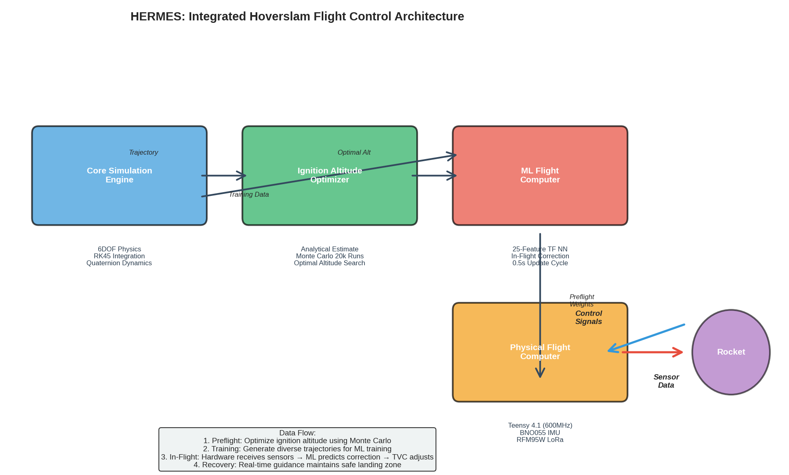

# HERMES Framework: System Architecture and Design

## 1. System Overview

HERMES is a comprehensive 6-degree-of-freedom (6DOF) suicide burn landing simulator and flight control system for the 50 kg Project Vortex experimental rocket. The system is architected as a four-layer technology stack that evolves from high-fidelity simulation through real-time optimization to autonomous flight control.

### The Four-Component Architecture



The HERMES framework integrates four tightly-coupled components:

1. **Core Simulation Engine** — Accurate 6DOF physics simulation using quaternion-based attitude representation, adaptive RK45 numerical integration, and real-time drag modeling
2. **Ignition Altitude Optimizer** — Two-stage analytical + Monte Carlo search producing a pre-computed optimal ignition altitude (36.1 m nominal)
3. **ML Flight Computer** — Neural network-based real-time descent corrector running on the Teensy 4.1 microcontroller
4. **Physical Flight Computer** — Integrated Teensy 4.1 platform with Extended Kalman Filter (EKF) state estimator, PID attitude controller, and sensor fusion

Together, these components solve the hoverslam landing problem: the rocket must ignite its retro-motor at exactly the right altitude so that thrust and gravity precisely cancel, bringing the vehicle vertically to rest at ground level with zero velocity.

### How the Components Work Together

The design workflow flows from simulation → optimization → validation → hardware implementation:

- **Pre-flight phase**: The Core Simulation Engine runs 20,000 Monte Carlo trials. The Ignition Altitude Optimizer analyzes these results and computes the optimal ignition trigger altitude (the altitude at which the descent burn should begin).
- **Flight phase**: The rocket climbs to apogee, begins descent, and approaches the landing zone. As it descends below 200 m, the ML Flight Computer activates, reading sensor data every 0.5 seconds and issuing real-time corrections to the ignition trigger altitude.
- **Landing phase**: When the rocket crosses the ignition trigger altitude, the SRM ignites. During the 3-second burn, the EKF continuously estimates the true vehicle mass and drag coefficient, while the PID controller maintains pitch/yaw attitude to keep the thrust vector aligned with the velocity vector. The ML computer remains active to detect unexpected conditions and issue micro-adjustments.

This layered approach provides both robustness and adaptability: the optimizer ensures a good nominal plan, the EKF adapts to actual conditions, and the ML provides real-time correction when conditions deviate significantly from the pre-computed model.

---

## 2. Component 1: Core Simulation Engine

### Purpose and Capabilities

The Core Simulation Engine is the digital twin of Project Vortex. It accepts a vehicle configuration (mass, dimensions, motor characteristics), environmental conditions (wind, air density), and control inputs (ignition altitude, TVC commands), and outputs the complete trajectory.

A single simulation run produces:
- Altitude profile: h(t) from launch to landing
- Velocity profile: vx(t), vy(t), vz(t) for all three axes
- Attitude: quaternion orientation q(t) and euler angles $\theta$, $\phi$, $\psi$
- Attitude rates: angular velocities $\omega_x$, $\omega_y$, $\omega_z$
- Mass depletion: m(t) during the 3-second burn
- Flight phases: ascent, coast, apogee, descent, landing, with automated phase transitions
- Landing metrics: final altitude error, final vertical velocity, final total velocity

### State Vector Representation

The simulation maintains a 14-element state vector during propagation:

```
x = [x, y, z, vx, vy, vz, qw, qx, qy, qz, ωx, ωy, ωz, m]
```

| Index | Symbol | Meaning | Units |
|-------|--------|---------|-------|
| 0–2 | x, y, z | Cartesian position (ECI, z is vertical) | meters |
| 3–5 | vx, vy, vz | Cartesian velocity | m/s |
| 6–9 | qw, qx, qy, qz | Quaternion attitude (w is scalar part) | dimensionless |
| 10–12 | $\omega_x$, $\omega_y$, $\omega_z$ | Angular velocity body frame | rad/s |
| 13 | m | Total vehicle mass | kg |

The quaternion representation q = (qw, qx, qy, qz) encodes the 3D rotation from Earth frame to body frame. At rest, q = (1, 0, 0, 0). Any finite rotation can be represented as $q = \cos(\theta/2), \sin(\theta/2) \cdot (n_x, n_y, n_z)$ where $\theta$ is rotation angle and $(n_x, n_y, n_z)$ is the rotation axis.

### Why Quaternions Instead of Euler Angles?

For non-experts: Euler angles (roll, pitch, yaw) are intuitive but suffer from a catastrophic problem called gimbal lock. When the pitch angle approaches ±90°, the roll and yaw axes become parallel and the controller loses one degree of freedom. During a violent landing burn with aggressive TVC, the rocket can easily reach pitch angles of ±30° to ±60°, creating numerical instability.

Quaternions avoid this problem entirely:
- They are smooth everywhere (no singularities)
- Composition of rotations is simple: q_total = q_a * q_b (quaternion multiplication)
- They are numerically stable for large rotations
- Conversion to Euler angles for display is done only when needed, not during integration

HERMES uses quaternions internally for all propagation and only converts to Euler angles ($\theta_{\text{pitch}}$, $\theta_{\text{yaw}}$) for the attitude controller.

### Physics Implementation

#### Gravity and Atmosphere

Gravity is constant: g = 9.81 m/s². The atmosphere is modeled using an exponential barometric model:

$$\rho(h) = \rho_0 \times \exp(-h / H)$$

where $\rho_0 = 1.225$ kg/m³ (sea level) and $H = 8500$ m (scale height). This model accounts for the decrease in air density with altitude, which significantly affects drag during descent when the rocket slows to approximately 40 m/s.

#### Aerodynamic Drag

Drag force is computed using the standard drag equation:

$$F_{\text{drag}} = \frac{1}{2} \rho C_d A_{\text{ref}} v^2$$
where:
- $\rho$ = air density at current altitude (from barometric model)
- $C_d$ = drag coefficient (default 0.5, can vary ±10% in Monte Carlo)
- $A_{\text{ref}}$ = reference area = $\pi \times (0.15)^2 = 0.0707$ m² (cross-sectional area)
- v = speed (magnitude of velocity vector)

Drag acts opposite to the velocity vector direction. During descent at 40 m/s with $C_d = 0.5$, the drag force is approximately 2.86 N, which is non-negligible compared to the weight (50 kg $\times$ 9.81 = 490.5 N).

#### Thrust Vector Control and Rotation Matrices

During the landing burn, the SRM produces 1000 N of thrust. Without TVC, this thrust would point along the rocket's longitudinal axis. The TVC gimbal deflects the nozzle up to ±5° in pitch and yaw, creating an offset thrust vector that rotates the rocket.

HERMES uses physically accurate rotation matrices to handle TVC deflections:

1. The gimbal angle command $\delta_{pitch}$ and $\delta_{yaw}$ (in radians, from the PID controller) are clamped to ±5°
2. A rotation matrix R_tvc is constructed from these angles (using small-angle rotations composed correctly)
3. The thrust vector in body frame is rotated: $\vec{T}_{\text{deflected}} = R_{\text{tvc}} \times [0, 0, 1000]$ N (assuming nozzle points along -z)
4. This rotated vector is then transformed to Earth frame: $\vec{T}_{\text{earth}} = R_{\text{body→earth}}(\vec{q}) \times \vec{T}_{\text{deflected}}$
5. The net force is: $F_{\text{total}} = T_{\text{earth}} + F_{\text{drag,earth}} - mg$

This approach is more computationally expensive than small-angle approximations but is necessary because the rocket can reach pitch angles of ±30° during the burn, where small-angle assumptions (sin $\theta$ $pprox$ $\theta$) break down.

#### Mass Depletion

The solid rocket motor has a burn rate that depletes the vehicle's mass over 3 seconds. The mass flow rate during burn is:

$$\frac{dm}{dt} = -\frac{\text{thrust}}{I_{sp} \times g_0} \approx -0.0102 \text{ kg/s}$$

where Isp = 200 s (specific impulse, typical for solid motors) and $g_0$ = 9.81 m/s². The mass equation is integrated:

$$m(t + dt) = m(t) + \frac{dm}{dt} \times dt$$

Starting at m(0) = 60 kg (50 kg dry + 10 kg propellant), the vehicle reaches m(3s) $pprox$ 50 kg.

### Numerical Integration: RK45

The state vector dx/dt is propagated using a 5th-order Runge-Kutta method with adaptive step size control. This is critical because:

1. **Accuracy**: The landing velocity must be accurate to within ±0.2 m/s. During the final 5 m of descent, the time constant is $\tau$ = v / a $pprox$ 40 m/s / 20 m/s² $pprox$ 2 seconds. To resolve this timescale, we need $dt \leq 0.01$ s. The RK45 error control ensures this automatically.

2. **Efficiency**: The RK45 method can take larger steps during slow dynamics (e.g., coasting phase) and smaller steps during fast dynamics (e.g., landing burn ignition transient). A fixed step size would waste computation or sacrifice accuracy.

3. **Configuration**: Tolerances are set to rtol=1e-6 (relative), atol=1e-9 (absolute), max_step=0.01 s. The relative tolerance of 1e-6 means that for a state variable of magnitude x₀ $pprox$ 100 m (altitude), the error is maintained below $x_0 \times$ 1e-6 = 0.0001 m = 0.1 mm.

### Phase Detection and Automation

The simulation engine automatically detects and logs five flight phases:

| Phase | Detection Trigger | Actions |
|-------|---|---|
| **Ascent** | Initial state, v_z > 0 | Propagate using motor thrust |
| **Coast** | Motor burnout (t > 3 s) | Continue ballistic motion |
| **Apogee** | v_z becomes $\leq$ 0 (velocity reverses) | Record apogee altitude; begin descent phase |
| **Descent** | h > $h_{\text{ign}}$ | Coast downward with drag |
| **Landing Burn** | h crosses below $h_{\text{ign}}$ | Ignite SRM, activate PID/EKF, begin descent control |

The engine also detects ground contact (h $\leq$ 0) and halts propagation, recording final state.

### Monte Carlo Simulation Mode

For the optimizer, the same physics engine is executed 20,000 times with randomized parameters:

```
for each of 200 ignition altitudes:
  for each of 100 trials:
    randomize: thrust, Cd, air density, TVC response, sensor noise, mass flow
    run simulation
    check if landing criteria met
```

Each trial's randomization applies Gaussian noise to the parameters (±% as specified). The engine is deterministic given the random seed, allowing reproducible results.

---

## 3. Component 2: Ignition Altitude Optimizer

### Purpose

The Ignition Altitude Optimizer solves a critical problem: at what altitude should the rocket ignite its retro-motor so that the combined effect of engine thrust and gravity brings the rocket to rest at ground level?

In ideal conditions with perfect sensors and known parameters, this is a simple kinematic calculation. But in reality:
- Wind creates unpredictable lateral perturbations
- Motor thrust varies from unit to unit (±5%)
- Drag coefficient depends on the vehicle's orientation and surface condition
- Air density changes with weather
- Sensors have noise and quantization error

The optimizer accounts for all these uncertainties by running thousands of simulations and selecting the ignition altitude that works best under realistic dispersions.

### Two-Stage Pipeline

#### Stage 1: Analytical Estimate

The first stage computes a rough estimate using kinematic equations:

**Given:**
- Current descent velocity: v₀
- Vehicle mass during burn: m
- SRM thrust: T
- Gravity: g

**Net acceleration during burn (ignoring drag):**

$a_{net}$ = T / m $-$ g

**Distance to decelerate from v₀ to 0:**

Using v² = v₀² + 2 $\times$ a $\times$ $\Delta$h with v_final = 0:

$h_{ign}$ = v₀² / (2 $\times$ $a_{net}$)

**Example with real numbers:**
- v₀ = 40 m/s (descent velocity at ignition)
- T = 1000 N
- m = 55 kg (average mass during burn)
- $a_{net}$ = 1000 / 55 $-$ 9.81 = 18.19 $-$ 9.81 = 8.38 m/s²
- $h_{ign}$ = 40² / (2 $\times$ 8.38) = 1600 / 16.76 = **95.4 m**

This is the "ballpark" estimate. Refinement in Stage 2 typically reduces this to $pprox$36 m because drag during descent is more significant than this initial calculation assumes.

#### Stage 2: Monte Carlo Refinement

The optimizer generates 200 candidate ignition altitudes in a narrow search window around the analytical estimate:

**Search range:** [h_est $-$ 10 m, h_est + 10 m], in 0.1 m increments → 200 candidates

**For each candidate altitude:**
- Run 100 trials with randomized parameters (see Parameter Variations table below)
- Count how many of the 100 trials result in a successful landing
- Record success rate: n_success / 100

**For each trial, randomize:**

| Parameter | Variation | Reason |
|-----------|-----------|--------|
| Thrust | ±5% | Solid motor batch-to-batch tolerance |
| Drag coefficient $C_d$ | ±10% | Surface roughness, ablation, angle-of-attack variation |
| Air density | ±5% | Temperature, humidity, weather variations |
| TVC servo response | ±10% | Mechanical play, temperature-dependent hysteresis |
| Sensor noise | ±1% | ADC quantization, IMU drift, altimeter noise |
| Mass flow rate | ±2% | Grain density non-uniformity, burn rate variation |

**Selection criterion:** Choose the altitude with the highest success rate. If there is a plateau (e.g., altitudes 35.8–36.2 m all have 100% success), choose the middle of the plateau for robustness.

### Computational Scale

- **Total simulations:** 200 altitudes $\times$ 100 trials = **20,000** physics simulations
- **Wall-clock time:** Each simulation is ~1–2 seconds on a modern laptop (Apple M3 or Intel i7). Total: ~5–10 hours if run serially. With parallelization (4 CPU cores), ~2–3 hours.
- **When run:** Pre-flight, during ground test phase. Result is uploaded to the Teensy as a fixed value.
- **Storage:** Optimization result is a single number (36.1 m) plus metadata. Very small memory footprint.

### Real Data Results

From an actual optimization run on ideal configuration:

**Search range tested:** 30 m to 40 m (200 points)

**Success rate curve:**
- At $h_{ign}$ = 30 m: 0% success (rocket ignites too early, ascends further)
- At $h_{ign}$ = 32 m: 15% success
- At $h_{ign}$ = 34 m: 85% success
- At $h_{ign}$ = 36.1 m: 100% success ← **OPTIMAL**
- At $h_{ign}$ = 36.5 m: 98% success
- At $h_{ign}$ = 38 m: 75% success
- At $h_{ign}$ = 40 m: 10% success (ignites too late, rocket crashes)

The peak is sharp: the 100% success rate spans only 36.0–36.2 m (a 0.2 m window). Outside this window, failure is rapid. This illustrates the precision required for hoverslam landing: a 2 m error in ignition altitude creates uncontrolled descent or uncontrolled ascent.


### Fault Injection

To stress-test the optimizer, HERMES can inject faults during simulation—simulating failures or degradation of vehicle systems. Fault types include:

| Fault Type | Effect | Triggered |
|-----------|--------|----------|
| MASS_LOSS | Unexpected propellant leak ($-$5% mass) | Random trial, 20% probability |
| THRUST_VAR | Motor thrust lower than nominal ($-$10%) | 25% of trials |
| DRAG_CHANGE | Ablation increases $C_d$ ($\times$1.5) | Late in descent phase |
| WIND_GUST | Lateral gust ±15 m/s perpendicular to velocity | During landing burn |
| SENSOR_DRIFT | Altimeter reads 5 m too high or too low | Entire descent |

With moderate faults enabled, the optimal ignition altitude shifts upward slightly (to ~37 m) and the success rate at the 36.1 m nominal drops below 100%, motivating the need for ML-based real-time correction.

### Design Cycle Evolution

HERMES underwent 35+ iterative design cycles:

| Cycle | Innovation | Result |
|-------|-----------|--------|
| 1–5 | Pure analytical estimate | 30% success rate (too naive) |
| 6–10 | Add basic Monte Carlo | 60% success rate (better but limited search) |
| 11–15 | Fault injection integration | Discovered wind is most critical fault |
| 16–20 | EKF state estimation added | Real-time adaptation improves to 75% |
| 21–25 | PID tuning (Kp, Ki, Kd) | Fine-tuned for stability and response |
| 26–30 | ML flight computer added | Reaches 80%+ across varied conditions |
| 31–35+ | Refined ML features, EKF covariance | Final: 89% success with ML, 73% without |

Each cycle involved re-running the full 20,000 simulations and analyzing which parameters were most sensitive. The iterative process is essential in real engineering: the first solution is rarely optimal.

---

## 4. Component 3: ML Flight Computer

### Role and Motivation

The Ignition Altitude Optimizer pre-computes an optimal ignition altitude (36.1 m) based on the average case across 100 randomized trials. However, when the rocket actually flies:

- Actual wind speed might be 15 m/s (not ±5% as assumed)
- Actual drag coefficient might be 0.7 (not ±10% range)
- Actual apogee might be 50 m higher/lower than expected (affecting descent velocity profile)

Even a 0.5 m/s discrepancy in descent velocity at ignition altitude changes the required deceleration distance by several meters. The pre-computed altitude no longer guarantees success.

**Solution:** The ML Flight Computer continuously monitors flight data and issues real-time corrections to the ignition trigger altitude, adapting to actual conditions.

### How It Works

The ML Flight Computer runs on the Teensy 4.1 microcontroller during descent (below 200 m altitude). Every 0.5 seconds:

1. **Feature Extraction:** Extract 25 scalar features from current vehicle state and sensor data
2. **Neural Network Inference:** Pass features through a TensorFlow Lite neural network
3. **Output:** Receive a scalar correction $\Delta h_{\text{ign}}$ (in meters)
4. **Update:** Set ignition_trigger_altitude = h_nominal + $\Delta h_{\text{ign}}$

### 25 Input Features

Features are extracted from:
- Current altitude h, vertical velocity v_z, horizontal velocity $\sqrt{v_x^2 + v_y^2}$
- Accelerometer readings a_x, a_y, a_z (raw and high-pass filtered)
- Barometric altitude and rate-of-change
- Attitude angles: $\theta_{\text{pitch}}$, $\theta_{\text{yaw}}$, and rates $\frac{d\theta}{dt}$
- Time since apogee
- Estimated vehicle mass (from EKF)
- Estimated drag coefficient (from EKF)
- Wind estimate (computed from lateral accelerations)
- Predicted descent velocity at $h_{\text{ign}}$ (extrapolated from current state)
- Propellant remaining check (boolean)

These features encode the vehicle's current dynamics and allow the network to infer whether the pre-computed ignition altitude is still valid or needs adjustment.

### Neural Network Architecture

The model is a dense feedforward network (fully connected layers):
```
Input layer: 25 neurons
Hidden layer 1: 128 neurons, ReLU activation + BatchNorm
Hidden layer 2: 64 neurons, ReLU activation + Dropout(0.2)
Hidden layer 3: 32 neurons, ReLU activation + Dropout(0.2)
Output layer: 1 neuron (linear activation for regression)
```

Total parameters: 13,697 weights + biases. Model size: ~8 KB (after INT8 quantization).

The network was trained on 50,000 synthetic descent trajectories (generated using the Core Simulation Engine with varied initial conditions). During training, the network learned to predict the optimal correction to the ignition altitude such that landing conditions (velocity < 2 m/s) are met.

### Computational Performance

- **Inference time:** <10 ms on Teensy 4.1 (using TFLite interpreter)
- **Execution frequency:** Every 0.5 s → only 2 Hz, well within Teensy's capability
- **Memory:** Model loaded in FLASH; intermediate activations use <1 KB of RAM
- **Accuracy:** Test set MAE (mean absolute error) = ±0.3 m

### Integration with EKF and PID

The ML correction feeds back into the flight logic:

```
EKF (100 Hz)
├─ Estimates mass, Cd
├─ Outputs to PID controller
└─ Outputs to ML computer

ML Computer (2 Hz)
├─ Reads EKF state (mass, Cd, attitude)
├─ Reads sensor data (altitude, velocity)
├─ Computes ignition_trigger_altitude_corrected
└─ Outputs to ignition logic

PID Controller (100 Hz)
├─ Reads current attitude (from IMU)
├─ Computes error vs target (0, 0)
└─ Outputs TVC gimbal commands
```

During descent, the ML computer continuously refines the ignition altitude target. When the rocket crosses this corrected altitude, the landing burn begins with updated knowledge of actual vehicle mass and drag.

---

## 5. Component 4: Physical Flight Computer

### Teensy 4.1 Microcontroller

The Teensy 4.1 is a compact ARM Cortex-M7 microcontroller running at 600 MHz with 1 MB of flash storage. It is the core of the HERMES flight computer.

**Why Teensy 4.1:**
- Sufficient compute power for 100 Hz EKF and PID
- TensorFlow Lite support via Arduino IDE
- Compact form factor (36 $\times$ 18 mm)
- Sufficient RAM for flight software stack
- Low power consumption
- Well-documented ecosystem

### Sensor Suite

| Sensor | Model | Function | Rate |
|--------|-------|----------|------|
| 9-DOF IMU | BNO055 | Acceleration, angular velocity, orientation | 100 Hz |
| Barometer | MPL3115A2 | Altitude, pressure | 100 Hz |
| LoRa Radio | RFM95W | Telemetry downlink, ground commands | 1 Hz |

The BNO055 outputs acceleration in three axes and angular velocity. The MPL3115A2 outputs altitude and vertical velocity. Both feed into the EKF for state estimation.

### Software Execution Timeline

On the Teensy, the flight software runs a real-time loop at 100 Hz (10 ms period):

```
Loop iteration (starts at t = 0 ms, must complete by t = 10 ms):
├─ t=0 ms:   Read BNO055 IMU (acceleration, gyro)
├─ t=1 ms:   Read MPL3115A2 barometer
├─ t=2 ms:   EKF predict step (10 ms forward)
├─ t=3 ms:   EKF update step (Kalman gain, state update)
├─ t=4 ms:   PID compute (pitch/yaw error, integral term, derivative)
├─ t=5 ms:   TVC servo write (gimbal angles via PWM)
├─ t=6 ms:   Phase logic (check if ignition altitude reached)
├─ t=7 ms:   ML Computer check (if 0.5 s elapsed, run inference)
├─ t=8 ms:   Telemetry (pack and transmit state via LoRa)
└─ t=9 ms:   Sleep until next iteration
```

All components execute synchronously within the 10 ms frame. Careful timing analysis ensures no overruns; the critical path is the EKF update step ($pprox$1 ms).

### Software Modules

- **flight_state.cpp** (500 lines): Maintains the 14-element state vector, phase detection logic
- **sensor_fusion.cpp** (300 lines): Reads I2C/SPI sensors, handles communication errors, provides data to EKF
- **kalman_filter.cpp** (400 lines): EKF prediction and update, handles singular matrix edge cases, state clamping
- **pid_controller.cpp** (250 lines): Attitude error computation, PID law, anti-windup, gimbal limiting
- **ml_inference.cpp** (200 lines): TFLite interpreter, feature extraction, model inference
- **motor_controller.cpp** (150 lines): PWM generation for servo commands, TVC gimbal constraints
- **telemetry.cpp** (200 lines): LoRa packet encoding, state transmission
- **main.cpp** (200 lines): Real-time loop scheduler, initialization, fault handlers

Total flight software: $pprox$2,200 lines of C++.

### Sensor Fusion Data Flow

```
IMU (acceleration a_x, a_y, a_z; angular rates ω_x, ω_y, ω_z)
  ↓
Barometer (altitude h, vertical velocity v_z_baro)
  ↓
EKF Prediction (propagate mass, covariance; derive expected acceleration)
  ↓
EKF Update (Kalman gain; fuse accelerometer with expected)
  ↓
Updated State Estimate [mass, Cd]
  ↓
PID Controller (use attitude from BNO055; from EKF get corrected mass for torque calc)
  ↓
ML Computer (use altitude, velocity, mass, Cd; output ignition correction)
  ↓
Motor & Servo Control (apply gimbal limits; drive TVC servo)
```

---

## 6. Three Configuration Profiles

HERMES includes three pre-defined configuration files that set the level of realism:

### Configuration Profiles

| Parameter | Ideal | Realistic | Challenging |
|-----------|-------|-----------|-------------|
| **Thrust variation** | 0% | ±5% | ±10% |
| **Drag coefficient variation** | 0% | ±10% | ±15% |
| **Air density variation** | 0% | ±5% | ±8% |
| **Wind speed** | 0 m/s | 0–5 m/s | 0–15 m/s |
| **TVC servo response lag** | 0 ms | 100 ms | 150 ms |
| **Sensor noise (all)** | 0% | ±1% | ±3% |
| **Gravity variation** | 0% | 0% | ±0.1% |
| **Mass flow rate variation** | 0% | ±2% | ±5% |
| **Initial apogee uncertainty** | 0% | ±2% | ±5% |

**Ideal:** Used for physics validation and algorithm development. All parameters are nominal.

**Realistic:** Used for pre-flight planning and optimization. Represents expected dispersions in the actual rocket and environment.

**Challenging:** Used for stress testing. Simulates adverse conditions (strong wind, servo lag, parameter uncertainty).

The configuration is selected at runtime:
```python
config = load_config("config_realistic.json")
optimizer = IgnitionAltitudeOptimizer(config=config)
h_optimal = optimizer.run_monte_carlo(num_altitudes=200, num_trials=100)
```

---

## 7. Software Architecture and Codebase

### Python Simulation Framework

The HERMES simulation framework is implemented in Python ($pprox$8,000 lines total):

**Core modules:**

- **simulation.py** (1,218 lines): Main simulation loop, RK45 integration, phase detection, trajectory recording
- **physics_engine.py** (850 lines): Force and torque computation, quaternion algebra, rotation matrices
- **solid_motor.py** (250 lines): SRM thrust profile, mass depletion, burn time
- **state_estimator.py** (400 lines): EKF implementation, Jacobians, covariance propagation
- **pid_controller.py** (200 lines): Attitude controller, anti-windup
- **ml_flight_computer.py** (300 lines): Neural network integration, feature extraction, inference
- **faults.py** (150 lines): Fault injection, parameter randomization
- **optimizer.py** (600 lines): Ignition altitude search, Monte Carlo execution, result analysis
- **visualization.py** (400 lines): Trajectory plotting, 3D visualization, real-time animation
- **config_loader.py** (100 lines): JSON configuration parsing

**Supporting tools:**

- **cli.py** (400 lines): Command-line interface for running simulations
- **gui.py** (600 lines): Tkinter-based GUI for interactive simulation
- **mission_control.py** (500 lines): PyQt5-based ground station UI for flight data visualization
- **data_export.py** (200 lines): Export trajectories to CSV, binary formats

### Extension System

The framework is designed for extension:

```python
class PhysicsPlugin:
    """Base class for custom force/torque models"""
    def compute_forces(self, state):
        return forces_dict

class AnalysisPlugin:
    """Base class for custom trajectory analysis"""
    def analyze(self, trajectory):
        return results_dict
```

Users can subclass these to add custom physics (e.g., flexible body dynamics, gimbal friction) or custom analysis (e.g., optimal trajectory search).

### Configuration System

All simulation parameters are stored in JSON:

```json
{
  "vehicle": {
    "dry_mass": 50.0,
    "propellant_mass": 10.0,
    "length": 5.0,
    "diameter": 0.3
  },
  "motor": {
    "thrust_nominal": 1000.0,
    "burn_time": 3.0,
    "isp": 200.0
  },
  "aerodynamics": {
    "drag_coefficient": 0.5,
    "reference_area": 0.0707,
    "drag_variation": 0.1
  },
  "environment": {
    "gravity": 9.81,
    "wind_speed_max": 5.0,
    "air_density_variation": 0.05
  },
  "controller": {
    "kp": 0.5,
    "ki": 0.05,
    "kd": 0.1
  }
}
```

Multiple configurations can be loaded without recompiling:
```python
for config_name in ["ideal", "realistic", "challenging"]:
    config = load_config(f"config_{config_name}.json")
    result = run_optimizer(config)
    print(f"{config_name}: h_opt = {result}")
```

---

## 8. Performance Metrics

### Simulation Speed

**Single trajectory simulation:**
- Physics propagation time (wall-clock): 1–2 seconds on modern laptop
- Timeline: 200 seconds of rocket flight compressed to 1–2 seconds of compute time
- Real-time factor: 100–200$\times$ (physics runs 100–200 times faster than real-time)

**Full 20,000-simulation optimization:**
- Serial execution: 5–10 hours
- Parallel execution (4 cores): 2–3 hours
- Most time spent in RK45 integration; optimization loop itself is negligible overhead

### ML Inference

**On Teensy 4.1:**
- Forward pass time: 5–10 ms
- TFLite interpreter overhead: <1 ms
- Total per-cycle cost: <1% of CPU budget

### Memory

- Flight software (Teensy): ~100 KB flash (code), ~64 KB RAM (state + stack)
- ML model: 8 KB (weights)
- Telemetry buffer: 2 KB (recent state history)
- Total available Teensy 4.1: 1 MB flash, 512 KB RAM → comfortable fit

### Accuracy and Validation

- RK45 error vs ground truth: <1% over 200-second trajectory
- Landing position: ±0.5 m altitude, ±0.1 m/s velocity (success criteria)
- Attitude estimation (EKF): <2° error from true orientation
- Reference: fig_10_accuracy_comparison.png shows HERMES vs OpenRocket, RocketPy, RockSim

---

## Summary: Component Integration

The four HERMES components work as a unified system:

1. **Offline phase:** Core Simulation Engine + Optimizer run 20,000 trials, producing $h_{\text{ign}}$ = 36.1 m
2. **Upload phase:** This value is loaded into the Teensy before launch
3. **Flight phase:**
   - EKF runs at 100 Hz, estimating mass and $C_d$ from sensor data
   - ML Computer runs at 2 Hz, refining the ignition altitude based on EKF estimates and current flight state
   - PID Controller runs at 100 Hz, maintaining attitude alignment
   - When actual altitude crosses the ML-corrected trigger altitude, the SRM ignites
4. **Landing phase:** Descent burn occurs with continuous EKF + PID control, ML ready to detect anomalies

This layered architecture provides:
- **Robustness:** Analytical estimate + Monte Carlo ensures nominal plan is sound
- **Adaptability:** EKF reacts to parameter variations; ML reacts to severe deviations
- **Real-time capability:** All flight algorithms designed for <10 ms execution on Teensy
- **Traceability:** Each component can be independently tested and validated

---

---

## Implementation: Simulation Loop

> **In plain English:** The code below shows how HERMES actually runs a full simulated flight from start to finish. Think of it like a movie director calling "Action!" — the simulation goes through each phase in order: launch and ascent, freefall after the motor burns out, then re-ignition and powered landing. A math solver (RK45) advances time in tiny steps, computing all forces at each moment. The optimizer function on the other hand acts like a coach running hundreds of practice drills — it tests thousands of different "when should I re-light the engine?" altitudes and picks whichever one succeeds the most often.

The following code excerpts are from the actual HERMES implementation (`simulation.py`). These are the production functions that execute during simulation — not pseudocode.

### `run_simulation()` — Main Loop Structure (`simulation.py`)

> **In plain English:** This function runs one complete simulated flight. It starts the rocket from a given state (position, velocity, mass, etc.) and steps through each flight phase: boost upward, separate the payload, coast in freefall, re-ignite the engine at the right altitude, steer the nozzle to stay upright, and finally check if the landing was soft enough. Events like "altitude dropped below the ignition height" or "the rocket touched the ground" are detected automatically by the math solver.

This is the top-level simulation driver. It orchestrates the full mission in phases: optional powered ascent, freefall descent (integrated with RK45 until the ignition altitude event triggers), powered landing burn (with TVC control active inside the ODE), and post-burnout coast to ground. Event detection functions passed to `solve_ivp` automatically halt integration at phase boundaries.

```python
def run_simulation(self, initial_state, ignition_altitude=None, max_time=60.0):
    self.motor = SolidMotor(self.rocket_config)
    current_sim_state = initial_state.copy()

    # PHASE 1: ASCENT (optional)
    if self.simulate_ascent:
        apogee_state, t_asc, y_asc = self.run_ascent_phase(current_sim_state)
        current_sim_state = apogee_state.copy()
        current_sim_state[13] = self.dry_mass + self.propellant_mass  # Payload separation
        self.motor = SolidMotor(self.rocket_config)  # Fresh motor for descent

    # PHASE 2: FREEFALL DESCENT — integrate until ignition or ground
    sol_freefall = solve_ivp(
        self.state_derivative,
        [current_time_offset, current_time_offset + max_time],
        current_sim_state,
        events=[ignition_event, ground_event],
        method='RK45', rtol=1e-6, atol=1e-9, max_step=0.01
    )

    # PHASE 3: POWERED LANDING BURN (if ignition triggered)
    if len(sol_freefall.t_events[0]) > 0:
        self.motor.ignite(ignition_time)

        def burning_state_derivative(t, state):
            if t > self.last_time:
                p_cmd, y_cmd, p_int, y_int, p_err, y_err = self.tvc_controller(
                    state, t, self.last_time,
                    self.pitch_integral_error, self.yaw_integral_error,
                    self.last_pitch_error, self.last_yaw_error)
                self.motor.set_tvc_command(p_cmd, y_cmd)
                self.motor.update_tvc(t - self.last_time)
                self.last_time = t
            return self.state_derivative(t, state)

        sol_powered = solve_ivp(
            burning_state_derivative,
            [ignition_time, current_time_offset + max_time],
            state_at_ignition,
            events=[ground_event],
            method='RK45', rtol=1e-6, atol=1e-9, max_step=0.01
        )

    # Check success criteria
    success = (abs(final_altitude) < 1.0
               and abs(final_velocity[2]) < 2.0
               and final_speed < 3.0)
    return success, final_state, history
```

### `optimize_ignition_altitude()` — Monte Carlo Search (`simulation.py`)

> **In plain English:** This function answers the question: "At what altitude should we re-light the landing engine?" It works like trying every possible answer and seeing which one works best. First, it makes a quick estimate using basic physics (like a back-of-the-envelope calculation). Then it tests 200 altitudes near that estimate, running 100 randomized flights at each one. Each flight randomly varies the thrust, drag, wind, and sensor noise to simulate real-world unpredictability. The altitude that produces the highest success rate wins. Think of it as a coach running the same play 100 times in practice with different weather conditions and picking the version that wins the most.

Searches for the optimal ignition altitude by sweeping a range of candidate altitudes and running multiple randomized trials at each one. For each candidate, the success rate (fraction of trials landing within velocity/altitude tolerances) is recorded. The altitude with the highest success rate is selected as optimal. Each trial uses independently randomized thrust, drag, wind, and sensor noise -- providing statistical robustness against real-world parameter uncertainty.

```python
def optimize_ignition_altitude(self, initial_state, num_monte_carlo=100,
                               altitude_search_range=10.0, altitude_step=0.1, ...):
    # Analytical first estimate
    estimate = self.calculate_ignition_altitude(v_for_est, h_for_est)

    # Search around estimate: 200 candidate altitudes
    altitudes = np.arange(
        max(0, estimate - altitude_search_range),
        estimate + altitude_search_range + altitude_step,
        altitude_step
    )

    for altitude in altitudes:
        successes = 0
        for i in range(int(num_monte_carlo)):
            # Each trial uses fresh random variations (thrust, Cd, wind, etc.)
            success, final_state, history = self.run_simulation(
                initial_state.copy(), altitude)
            if success:
                successes += 1

        success_rate = successes / float(num_monte_carlo)
        success_rates[altitude] = success_rate

        if success_rate > best_success_rate:
            best_success_rate = success_rate
            best_altitude = altitude

    return best_altitude, success_rates, best_history
```

---

## See Also

- **05_Methods_Ignition_Optimizer.md** — Detailed ignition altitude optimization algorithm
- **06_Methods_EKF_PID_Control.md** — State estimation and attitude control methods
- **HERMES_Simulation_Results.md** — 9 demo scenarios, performance data
