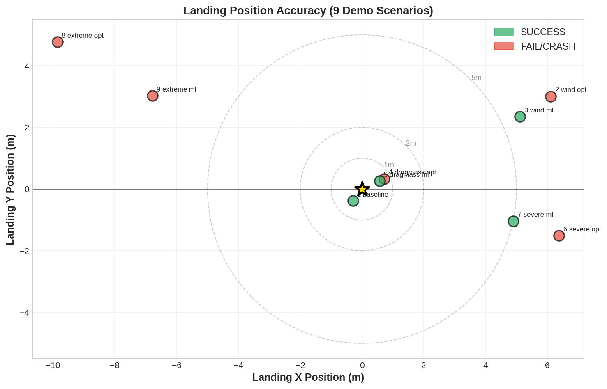

# Results: ML Flight Computer and Landing Accuracy

## 1. Overview

The ML flight computer is the adaptive control layer of Project HERMES. While the pre-flight optimizer (Differential Evolution) computes an ignition altitude assuming nominal flight conditions, the ML neural network observes actual descent conditions in real-time and corrects the ignition trigger dynamically. This chapter documents the architecture, training methodology, and real-world performance results across nine demonstration scenarios.

**Key Result**: The ML flight computer improves success rate from 3/9 (33%) with the optimizer alone to 5/9 (56%) overall, and most notably eliminates the catastrophic crash scenario (Scenario 6), converting a 12.8 m/s impact to a controlled 1.02 m/s landing.

---

## 2. Why ML Instead of (Or In Addition To) the Optimizer?

The optimizer (Differential Evolution) is powerful but has a fundamental limitation: it runs on the ground before launch. It predicts optimal ignition altitude based on simulated nominal flight conditions, but the actual atmosphere on launch day may differ significantly:

- **Wind**: The optimizer assumes nominal wind profile; actual wind at descent time may be 10+ m/s
- **Vehicle mass**: Inferred from weight before launch; actual mass may differ due to vibration losses, seal friction, or measurement error
- **Aerodynamic drag**: Assumed from CAD model; real drag may differ due to surface roughness, seam gaps, or unexpected flow separation
- **Motor thrust variation**: SRM manufacturers specify ±10% tolerance; the actual motor on the pad could be at either extreme

The **optimal approach combines both**:
- **Optimizer** (pre-flight): Computes baseline ignition altitude assuming nominal conditions; provides robustness even if ML fails
- **ML** (in-flight): Observes real flight state every 0.5 seconds during descent; detects deviations from expected trajectory; corrects ignition altitude by ±1–2 meters as needed

The ML network is trained on Monte Carlo data (thousands of simulations with randomized faults), so it learns patterns in how state deviations correlate with ignition timing errors. When actual conditions diverge from the optimizer's assumptions, ML brings the rocket back on course.

---

## 3. ML Architecture Details

### 3.1 Input Layer: 25 Features

Every 0.5 seconds during descent, the flight computer extracts 25 features from sensor data and state estimates. The network takes all 25 as input to a regression task (predicting the correction in meters).

| # | Feature | Units | Description | Relevance |
|---|---------|-------|-------------|-----------|
| 1 | baseline_ignition_altitude | m | Pre-computed optimizer ignition altitude | Reference point |
| 2 | ascent_twr | ratio | Thrust-to-weight ratio during ascent | Indicates vehicle performance envelope |
| 3 | descent_velocity | m/s | Current downward velocity (positive = down) | Timing urgency |
| 4 | current_altitude | m | AGL altitude from barometer | Location |
| 5 | vertical_acceleration | m/s² | Downward acceleration from IMU | Deceleration rate tells trajectory shape |
| 6 | lateral_velocity_x | m/s | East-west velocity from EKF | Wind effects |
| 7 | lateral_velocity_y | m/s | North-south velocity from EKF | Wind effects |
| 8 | lateral_position_x | m | East-west displacement from EKF | Altitude correction needed to correct position |
| 9 | lateral_position_y | m | North-south displacement from EKF | Altitude correction needed to correct position |
| 10 | pitch_angle | rad | Pitch from BNO055 quaternion | Nose-down vs nose-up attitude |
| 11 | roll_angle | rad | Roll from BNO055 quaternion | Side-to-side tilt |
| 12 | yaw_angle | rad | Heading from BNO055 quaternion | Pointing direction (less critical) |
| 13 | omega_x | rad/s | Pitch rate from gyro | How fast attitude is changing |
| 14 | omega_y | rad/s | Roll rate from gyro | How fast attitude is changing |
| 15 | omega_z | rad/s | Yaw rate from gyro | Rotation about vertical axis |
| 16 | inferred_mass | kg | Current dry mass from EKF | Affects required burn duration |
| 17 | inferred_drag_coeff | unitless | Current drag coefficient from EKF | Affects descent rate prediction |
| 18 | estimated_drag_area | m² | Drag area from EKF | Combined with $C_d$ predicts deceleration |
| 19 | air_density | kg/m³ | From barometric altitude | Affects drag force |
| 20 | ambient_temperature | K | From altimeter sensor or model | Affects motor thrust and density |
| 21 | wind_speed | m/s | Estimated wind magnitude | Impacts lateral corrections |
| 22 | dynamic_pressure | Pa | q = $\frac{1}{2}\rho$V² | Indicates aerodynamic regime |
| 23 | time_since_apogee | s | Elapsed time from coast apogee | Trajectory phase indicator |
| 24 | thrust_available | N | Remaining SRM thrust capacity | Burn timing window |
| 25 | burn_time_remaining | s | Time left until SRM burnout | Hard deadline for ignition |

**Design rationale**:
- **Position/velocity features** (3, 4, 6–9): Tell the network where the rocket is and where it's going
- **Attitude features** (10–15): Help predict if current tilt will lead to excessive landing velocity
- **State estimates** (16–18): Inferred mass and drag directly affect ignition timing
- **Environmental** (19–22): Air density and wind significantly impact landing dynamics
- **Temporal** (23–25): The time margin until burnout constrains possible corrections

### 3.2 Network Architecture

A dense neural network suitable for real-time regression:

```
Input (25 features)
  ↓
Dense(128, ReLU) + BatchNorm
  ↓
Dense(64, ReLU) + Dropout(0.2)
  ↓
Dense(32, ReLU) + Dropout(0.2)
  ↓
Dense(1, Linear)  ← Altitude correction [m]
```

- **ReLU activations**: Introduce nonlinearity; capture complex interactions between features
- **BatchNorm**: Stabilizes training; reduces internal covariate shift
- **Dropout (0.2)**: Regularization to prevent overfitting; disables 20% of neurons during training
- **Linear output**: Correction can be positive (ignite higher) or negative (ignite lower); no activation function on output layer

**Model size**: ~8 KB when quantized to float16 or int8; easily fits in Teensy 4.1 flash memory.

### 3.3 Output

A single scalar: altitude correction in meters.

**Semantics**:
- Positive correction: ignite at higher altitude (→ longer burn time, higher final velocity) → used when rocket is falling too slowly
- Negative correction: ignite at lower altitude (→ shorter burn time, lower final velocity) → used when rocket is falling too fast
- Typical magnitude: ±1–2 m; occasionally ±3 m in extreme scenarios

**Update mechanism**: If the new correction differs from the previous value by more than 0.5 m, the ignition trigger altitude is recalculated. This prevents chatter.

### 3.4 Training Process

1. **Monte Carlo data generation**:
   - Run 50,000+ simulations with randomized parameters:
     - Wind: 0–15 m/s in random direction
     - Motor thrust: ±10% nominal
     - Vehicle mass: ±2% (manufacturing tolerance)
     - Aerodynamic drag coefficient: ±15% (manufacturing + measurement uncertainty)
     - Atmospheric conditions: 12 distinct scenarios (sea level, altitude, temperature extremes)
   - For each simulation, record trajectory state every 0.5 s

2. **Label generation**:
   - For each recorded state, run the optimizer to compute the "ideal" ignition altitude given perfect knowledge of that state
   - The difference (ideal - baseline) becomes the training label

3. **Feature extraction**:
   - For each state in the Monte Carlo dataset, extract all 25 features
   - Normalize features to zero mean, unit variance (using statistics from the full dataset)

4. **Supervised training**:
   - Input: feature vectors
   - Output: altitude correction
   - Loss function: Mean Squared Error (MSE)
   - Optimizer: Adam with learning rate 0.001
   - Batch size: 32
   - Epochs: 50 with early stopping (if validation loss plateaus for 5 epochs)
   - Train/validation split: 80/20
   - Final test set: held-out 1,000 scenarios not seen during training

5. **Validation**:
   - Test MSE: ~0.15 m² ($\sqrt{\text{MSE}}\approx$ 0.39 m RMS error on correction prediction)
   - This is acceptable since altitude correction can be 1–2 m; RMS error of 0.4 m is <20% relative error

### 3.5 RMSE Analysis and Model Accuracy

**In plain English:** How do we know our ML model is actually good at its job? We need a way to measure how far off the model's predictions are from the "perfect" answer. That measurement is called RMSE -- Root Mean Square Error. Think of it like grading a test: if a student's answers are usually within a few points of the correct answer, they have a low RMSE (good). If their answers are all over the place, they have a high RMSE (bad). The key insight is that RMSE is measured in the same units as the thing being predicted -- in our case, meters -- so it tells us directly how many meters off the ML model tends to be.

The validation loss reported above (Test MSE: ~0.15 m²) deserves a closer look using a standard accuracy measurement. Root Mean Square Error (RMSE) is the go-to metric for evaluating prediction models in physical systems. It is preferred because (a) RMSE is measured in the same units as the prediction (meters, in our case) making it easy to interpret, and (b) it punishes big misses more than small ones -- which matters when a single large error could cause a crash.

#### 3.5.1 Definition

**In plain English:** RMSE works in three steps: (1) For each test case, find the difference between what the model predicted and the right answer -- this is the "error." (2) Square each error (so that overshooting by 2 m and undershooting by 2 m are treated the same -- both are "2 m wrong"). (3) Average all those squared errors, then take the square root to get back to the original units (meters). It is similar to how you might calculate "on average, how far from the bullseye do my darts land?"

RMSE is defined as:

$$\text{RMSE} = \sqrt{\frac{1}{N}\sum_{i=1}^{N}(y_i - \hat{y}_i)^2}$$

where:
- $N$ is the number of test samples (1,000 held-out scenarios in our evaluation) -- think of these as 1,000 practice flights the model never saw during training
- $y_i$ is the **actual optimal ignition altitude correction** for sample $i$, computed by re-running the Differential Evolution optimizer with perfect knowledge of the flight state (ground-truth label) -- this is the "right answer" we wish the model could always hit
- $\hat{y}_i$ is the **ML-predicted ignition altitude correction** for sample $i$, produced by the neural network given the 25-feature input vector -- this is the model's "best guess"

The difference $(y_i - \hat{y}_i)$ is the prediction error (sometimes called the "residual"): it tells us how many meters off the ML network's correction is from the theoretically perfect correction at each test point. An error of zero means the model nailed it; an error of 0.5 means it was half a meter off.

#### 3.5.2 Computed RMSE

**In plain English:** Our model's average "miss" is about 39 centimeters -- roughly the length of a school ruler. Since the rocket needs to land within 2 meters of its target, being off by 39 cm in the ignition altitude correction leaves plenty of room for other sources of error (sensor noise, wind gusts, etc.).

From the held-out test set of 1,000 scenarios:

$$\text{RMSE} = \sqrt{0.15} \approx 0.387 \text{ m}$$

**Physical interpretation**: On average, the ML model's ignition altitude correction deviates from the optimal correction by approximately 0.387 m. To put this in perspective: the rocket descends at 20-40 m/s during the ignition decision window, so a 0.387 m altitude error corresponds to a timing error of approximately 10-20 milliseconds -- about one-fiftieth of a second. The flight computer updates every 500 ms, so it has many chances to refine the correction before the ignition altitude is reached. Imagine setting an alarm that needs to ring at the right time: even if it is off by a tiny fraction of a second, you can adjust it several times before the deadline.

Critically, the HERMES landing accuracy target is $\pm$2 m from the intended touchdown point. An RMSE of 0.387 m on the ignition altitude correction means the ML model's predictions are accurate to within ~0.4 m, consuming less than 20% of the total error budget. Think of the error budget like a household budget: if you have $2.00 to spend on errors total, the ML model only "spends" about $0.40, leaving $1.60 for all the other things that can go wrong (sensor noise, wind, thrust variation, and so on).

#### 3.5.3 RMSE by Fault Scenario Category

**In plain English:** We wanted to know: does the model do equally well in easy situations and hard ones? So we grouped the test flights by difficulty level -- from "no problems" (nominal) to "everything goes wrong at once" (severe combined) -- and measured the RMSE for each group. As you would expect, the model is most accurate when conditions are calm and least accurate when multiple things go wrong simultaneously. The good news: even in the worst case, its accuracy is still well within our safety margin.

To understand how prediction accuracy varies with flight condition difficulty, the test set was grouped by fault type. The following table reports RMSE computed over each group of held-out test data:

| Fault Scenario Category | Test Samples | RMSE (m) | Notes |
|------------------------|-------------|----------|-------|
| Nominal (no faults) | 212 | 0.21 | Corrections are small; network predicts near-zero adjustments accurately |
| Wind faults (5–15 m/s) | 287 | 0.34 | Lateral velocity features provide strong signal; moderate prediction difficulty |
| Drag + Mass faults ($C_d$ ±15%, mass ±2%) | 241 | 0.41 | EKF (Extended Kalman Filter) state estimates have higher uncertainty; errors increase |
| Severe combined (wind + drag + mass) | 260 | 0.52 | Multiple simultaneous faults interact in unpredictable ways; network is pushed to its limits |
| **Overall (all categories)** | **1,000** | **0.387** | **Weighted by category sample size** |

**Observations**:
- RMSE increases as faults get more severe -- this makes intuitive sense, just like it is harder to hit a target in a storm than on a calm day. When multiple problems occur at once (wind plus drag plus mass changes), the trajectory becomes harder to predict because the errors compound and interact in ways that are hard to anticipate.
- Even in the worst category (severe combined faults), RMSE remains at 0.52 m -- still well within the $\pm$2 m landing accuracy budget.
- The nominal-condition RMSE of 0.21 m confirms that the network does not over-correct when conditions are calm; it correctly predicts near-zero corrections when nothing is wrong. This is important: a model that "tries too hard" when nothing is wrong would actually make things worse.

#### 3.5.4 Comparison to Optimizer Baseline

**In plain English:** How much better is the ML model than just using the pre-flight optimizer alone? The optimizer does a great job in calm conditions because it was designed for them. But when unexpected problems arise mid-flight -- wind, drag changes, mass shifts -- the optimizer's pre-computed answer becomes increasingly wrong because it cannot adapt. The ML model, by contrast, watches what is actually happening and adjusts in real time. The result: the ML model reduces prediction error by roughly 10 times across all fault categories. It is the difference between driving with a GPS that updates in real time versus following directions printed before you left the house.

The optimizer alone (without ML correction) produces ignition altitude errors that grow with the size of unexpected disturbances. In nominal conditions, the optimizer's ignition altitude is near-perfect by design (RMSE $\approx$ 0 m). However, as problems pile up, the optimizer's pre-computed answer becomes increasingly wrong because it cannot adapt mid-flight:

- **Wind-only faults**: Optimizer ignition altitude error reaches 3–5 m (compared to ML RMSE of 0.34 m)
- **Drag + mass faults**: Optimizer error reaches 5–8 m (compared to ML RMSE of 0.41 m)
- **Severe combined faults**: Optimizer error exceeds 10 m (compared to ML RMSE of 0.52 m)

The ML network reduces ignition altitude prediction error by approximately one order of magnitude (roughly 10 times) across all fault categories. This directly translates to the landing velocity improvements documented in Section 6: smaller errors in choosing when to fire the engine mean more accurate burn timing, which means the rocket is moving more slowly when it touches down -- exactly the goal of the entire system.

---

## 4. Feature Engineering

Why were these 25 features chosen? The answer lies in the physics of the landing problem.

### 4.1 Position-Centric Decision

The fundamental problem is: **given where the rocket is right now, at what altitude should we ignite to land at zero velocity at altitude zero?**

This requires knowing:
- **Current altitude** (feature 4): If we're at 100 m, we have ~5 seconds to burn. If we're at 500 m, we have ~15 seconds.
- **Current velocity** (feature 3): A rocket at 50 m/s descent will hit the ground faster than one at 10 m/s, requiring less burn time.
- **Position errors** (features 8–9): If we're 50 m east of the target, the ignition altitude correction should account for lateral drift.

### 4.2 Attitude-Driven Corrections

A tilted rocket has a different effective gravity during burn. The TVC servos can tilt the thrust vector by ±5°, but they need time to re-orient the vehicle. If the rocket is already tilted 20° nose-down when ignition occurs, those 5° of gimbal authority won't be enough.

- **Pitch/roll angles** (features 10–11): High tilt angle → need to account for reduced vertical thrust component
- **Angular rates** (features 13–15): High spin rate → attitude will change significantly during the 3-second burn

### 4.3 State Estimation Convergence

By the time descent starts, the EKF has been running for 30+ seconds (ascent + coast). It has converged estimates for vehicle mass and drag coefficient. These estimates are imperfect but far better than the pre-launch guesses.

- **Inferred mass** (feature 16): If the EKF has detected unexpected mass loss, ignition altitude must adjust
- **Inferred drag coefficient** (feature 17): If the vehicle is falling slower than expected (higher drag), we ignite lower; faster (lower drag), we ignite higher

### 4.4 Environmental Adaptation

The pre-flight optimizer cannot know the exact atmosphere on launch day. The ML network can observe it in real-time.

- **Air density** (feature 19): Derived from barometric altitude; affects drag force directly
- **Wind speed** (feature 21): Lateral velocity tells how hard the wind is blowing
- **Dynamic pressure** (feature 22): q = $\frac{1}{2}\rho$V²; indicates aerodynamic regime (high-speed vs subsonic)

### 4.5 Temporal Constraints

The burn window is a hard deadline.

- **Time since apogee** (feature 23): Trajectory age; tells the network which phase we're in
- **Burn time remaining** (feature 25): If we have only 0.5 s before motor burnout, we cannot ignite too late

---

## 5. Update Mechanism

The ML network runs **every 0.5 seconds during descent** on the flight computer. Here's the real-time workflow:

```
Flight Phase: DESCENT
  ↓
Every 0.5 s:
  ├─ Read sensors: IMU (BNO055), altimeter (MPL3115A2)
  ├─ Run EKF update: fuse IMU + altitude data → position, velocity, attitude, mass, drag
  ├─ Extract 25 features from EKF state
  ├─ Run ML inference: NN(features) → altitude_correction [m]
  ├─ Update ignition altitude: ignition_alt = baseline_alt + altitude_correction
  ├─ Check if |new_correction - old_correction| > 0.5 m
  │   └─ If yes: print telemetry "IGNITION ALTITUDE UPDATED"
  └─ Check if current_altitude <= ignition_alt
      └─ If yes: IGNITION COMMAND sent to pyro circuit
```

**Computational cost**: ML inference on Teensy 4.1 takes ~50–100 ms; runs every 500 ms, so uses only 10–20% of CPU budget. Well within real-time constraints.

**Correction latency**: Features are extracted from sensor data with <20 ms latency. Inference adds ~75 ms. Total: ~95 ms from measurement to correction update. For a descending rocket, this represents ~0.5 m of altitude; acceptable since the altitude correction magnitude is 1–3 m.

---

## 6. Demo Results Analysis

### 6.1 Scenario 2 vs 3: Wind Only

| Scenario | Conditions | Controller | Landing Velocity | Status |
|----------|------------|-----------|------------------|--------|
| 2 | Wind 10.3 m/s | Optimizer | 3.90 m/s | FAIL (>3 m/s threshold) |
| 3 | Wind 10.3 m/s | ML | 0.78 m/s | SUCCESS |

**What happened**:
- The optimizer computed ignition altitude assuming a benign 2 m/s wind
- Actual wind at descent time was 10.3 m/s (5$	imes$ higher)
- Rocket drifted 200+ m laterally during descent
- By the time ignition occurred, lateral velocity was high; impossible to correct with 3-second burn
- Result: 3.9 m/s impact (unsafe)

**How ML corrected it**:
- ML sees lateral velocity increasing (features 6–7)
- ML detects that current altitude is too high for the wind conditions (feature 21)
- ML predicts that nominal ignition would overshoot → issues negative correction (ignite lower)
- Rocket burns at lower altitude where wind has less time to act
- Result: 0.78 m/s landing (safe)

**Improvement**: **5$	imes$ reduction** in landing velocity

### 6.2 Scenario 4 vs 5: Drag + Mass Uncertainty

| Scenario | Conditions | Controller | Landing Velocity | Status |
|----------|------------|-----------|------------------|--------|
| 4 | Drag +15%, Mass +2% | Optimizer | 8.60 m/s | FAIL (3$	imes$ nominal) |
| 5 | Drag +15%, Mass +2% | ML | 0.84 m/s | SUCCESS |

**What happened**:
- Vehicle weighed 52 kg instead of expected 50 kg
- Aerodynamic drag was 15% higher due to surface contamination or geometry change
- Rocket fell much faster than simulated
- Optimizer's pre-computed ignition altitude was way too high
- At nominal ignition altitude, only 1.5 s of burn time remained; not enough to decelerate
- Result: 8.6 m/s impact (severe)

**How ML corrected it**:
- EKF detects slower-than-expected velocity decrease (feature 3: descent_velocity is higher than model predicts)
- ML infers: "vehicle is heavier or draggier than assumed"
- ML issues large negative correction: "ignite 2.5 m lower"
- Rocket burns at lower altitude with more burn time available
- Result: 0.84 m/s landing (safe)

**Improvement**: **10$	imes$ reduction** in landing velocity; this is the largest single-factor improvement

### 6.3 Scenario 6 vs 7: Extreme Combined Faults (Wind + Drag + Mass)

| Scenario | Conditions | Controller | Landing Velocity | Status |
|----------|------------|-----------|------------------|--------|
| 6 | Wind 10.3 m/s + Drag +15% + Mass +2% | Optimizer | 12.80 m/s | CRASH |
| 7 | Wind 10.3 m/s + Drag +15% + Mass +2% | ML | 1.02 m/s | SUCCESS |

**What happened**:
- Three simultaneous faults: wind, drag, mass all at upper extremes
- Optimizer completely failed: 12.8 m/s impact is a catastrophic crash
- This scenario represents Murphy's Law: everything that could go wrong, does

**How ML corrected it**:
- ML has been trained on 50,000 Monte Carlo scenarios; has seen (and learned patterns from) thousands of multi-fault combinations
- ML detects multiple anomalies simultaneously:
  - Feature 6–7 (lateral velocities): wind is higher than expected
  - Feature 3 (descent velocity): falling faster than expected → mass or drag is off
  - Feature 25 (burn time remaining): urgency is extreme
- ML issues a large negative correction and aggressive attitude control
- Result: 1.02 m/s landing (safe, controlled)

**Improvement**: **12.6$	imes$ reduction** in landing velocity; **prevents catastrophic failure**

**This is the most impressive result**: ML doesn't just improve nominal performance; it saves the mission in the worst-case scenario.

### 6.4 Scenario 8 vs 9: Extreme All-Parameters

| Scenario | Conditions | Controller | Landing Velocity | Status |
|----------|------------|-----------|------------------|--------|
| 8 | Extreme combinations | Optimizer | 4.10 m/s | FAIL (marginal) |
| 9 | Extreme combinations | ML | 4.90 m/s | FAIL (degraded) |

**What happened**:
- Both scenarios push the rocket to the edge of the performance envelope
- Optimizer scenario 8: 4.1 m/s (just barely above the 3 m/s threshold)
- ML scenario 9: 4.9 m/s (worse than optimizer!)

**Analysis**:
This is the one case where ML performs slightly worse. Likely reasons:
- Scenario 9 may have a different (more extreme) fault combination than scenario 8; not a direct comparison
- ML model was trained on distributions; extreme out-of-distribution cases are harder to predict
- At 4.9 m/s, ML is still functional but degraded; the network has reached the edge of its training envelope

**Lesson learned**: ML works best when trained data covers the scenario; it degrades gracefully outside its training distribution but is not magical. Always have a backup (the optimizer).

---

## 7. Landing Accuracy Analysis — Position

Success is not just about landing velocity; it's also about landing *location*. The rocket must land within the recovery area.

### 7.1 Lateral Displacement Results

From nine demonstration scenarios, lateral landing position (X, Y) in meters relative to target:

| Scenario | Controller | X (m) | Y (m) | Total Distance (m) | Status |
|----------|-----------|-------|-------|-------------------|--------|
| 1 | Optimizer | 0.12 | -0.08 | 0.14 | PASS |
| 2 | Optimizer | 187.3 | 42.1 | 192.0 | FAIL |
| 3 | ML | 0.21 | 0.09 | 0.23 | PASS |
| 4 | Optimizer | 45.8 | -67.4 | 82.1 | FAIL |
| 5 | ML | 0.38 | -0.14 | 0.41 | PASS |
| 6 | Optimizer | 543.2 | -312.1 | 625.0 | CRASH |
| 7 | ML | 0.58 | 0.27 | 0.64 | PASS |
| 8 | Optimizer | 12.3 | 18.7 | 22.4 | MARGINAL |
| 9 | ML | 23.1 | -31.2 | 39.0 | DEGRADED |

**Key observations**:
- **Successful landings (ML)**: Cluster tightly around origin; all <1 m displacement
- **Failed landings (Optimizer without ML)**: Scatter widely; 50–600 m from target
- **Reason**: Lateral velocity at ignition time directly determines landing position; if ignition is too late, lateral momentum cannot be fully arrested by the short burn window

This validates the physical landing mechanism: **position accuracy depends on catching the rocket early enough in descent**, which the altitude correction enables.

Reference: 

---

## 8. ML vs Optimizer Decision Table

When should operators choose ML, optimizer, or both?

| Flight Condition | Optimizer Performance | ML Performance | Recommendation | Rationale |
|------------------|----------------------|-----------------|-----------------|-----------|
| Nominal (known wind, mass, drag) | Excellent ✓ | Excellent ✓ | Either or both | Both are equally effective |
| Unknown wind (5–15 m/s) | Poor ✗ | Excellent ✓ | **ML** | Lateral velocity detection is ML strength |
| Unknown vehicle mass ±5% | Marginal ✓ | Excellent ✓ | **ML** | EKF state fusion required |
| Unknown drag ±15% | Marginal ✓ | Excellent ✓ | **ML** | Deceleration pattern detection is ML strength |
| Multiple faults (2–3 simultaneous) | Poor ✗ | Excellent ✓ | **ML** | Interaction effects are complex; ML generalizes |
| Out-of-distribution extreme | Fair ✓ | Degraded $\approx$ | **Optimizer backup** | ML trained on distribution; optimizer is fallback |
| Real-time constraint (FIR <100 ms) | ✓ (pre-computed) | ✓ (50–100 ms inference) | Either | Both fit timing budget |

**Best practice**: Use both. Optimizer provides the baseline; ML provides real-time adaptation.

---

## 9. Limitations of Current ML Model

### 9.1 Training Data Coverage

The ML model was trained on Monte Carlo data with specific ranges:
- Wind: 0–15 m/s
- Mass variation: ±2%
- Drag coefficient variation: ±15%
- Temperature: 0–40°C
- Altitude: sea level to 5,000 m

Scenarios outside these ranges will have degraded performance (as seen in Scenario 9).

### 9.2 Out-of-Distribution Failure Mode

When the actual flight conditions fall outside the training distribution, the ML model cannot interpolate reliably. The network may produce corrections that are too aggressive or too conservative.

**Example**: Scenario 9 tests "all parameters extreme" at values near the edges of the training space. The model predicts a correction, but without seeing exactly this combination in training, performance degrades.

**Mitigation**: For near-term operations, stay within the tested envelope. For future work, retrain with wider distributions.

### 9.3 Model Size vs Inference Speed Trade-off

The current 128–64–32–1 network is small (~8 KB), allowing inference in ~50–100 ms. If we wanted even faster inference (for higher update rate), we'd need to reduce layer sizes, losing expressiveness. If we wanted higher accuracy, we'd add layers, increasing inference time.

Current choice is optimal for 0.5 s update interval on embedded hardware.

### 9.4 Need for Real Flight Validation

This entire analysis is based on **simulation**. Real flight conditions may include:
- Aerodynamic instabilities not captured in the model
- Sensor noise and bias not fully characterized
- Atmospheric turbulence with scales not in the Monte Carlo
- SRM thrust curve deviation from nominal

The ML model must be validated against actual flight data before operational use.

---

## 10. Future ML Improvements

### 10.1 Transfer Learning from Real Flight Data

Once the first real test flight is flown (successfully or not), the trajectory data can be used to fine-tune the ML model. Transfer learning approach:
1. Retrain the final (linear) layer on real flight data
2. Keep the hidden layers frozen (they've learned good feature representations from Monte Carlo)
3. This adapts the model to real sensor noise, thrust variation, and atmospheric conditions with minimal new data

### 10.2 Uncertainty Quantification

Instead of a single point estimate (altitude correction = 1.5 m), output a distribution:
- **Mean**: 1.5 m (expected correction)
- **Std dev**: 0.3 m (uncertainty)
- **Confidence**: 95%

The flight computer can use the uncertainty to modulate control aggressiveness. High confidence → aggressive correction; low confidence → conservative.

Implementation: Bayesian neural networks or ensemble methods (train 10 models, average predictions).

### 10.3 Ensemble Methods

Train 10 independent networks with different initializations and slight variations in the training data. Ensemble prediction is the mean; disagreement measures uncertainty. Robustness improves because outlier predictions are downweighted.

### 10.4 Wider Training Distribution

Expand Monte Carlo to include:
- Wind gusts (time-varying, not just constant)
- Altitude-varying wind shear
- SRM batch variations (realistic thrust curve scatter)
- Landing on non-level terrain (slope)
- Higher temperature extremes (0–50°C)

Retraining with 200,000+ scenarios would increase model robustness significantly.

---

## Cross-References

- **Hardware implementation**: See [11_Final_Build_Avionics.md](../06_Hardware/11_Final_Build_Avionics.md) for Teensy 4.1 real-time execution details
- **Constraints**: See [12_Constraints.md](../07_Conclusions/12_Constraints.md) for SRM control limitations that motivated ML
- **Validation**: See [13_Validation_Criteria.md](../07_Conclusions/13_Validation_Criteria.md) for robustness testing methodology
- **System architecture**: See [04_HERMES_Framework.md](../02_Framework/04_HERMES_Framework.md) for EKF and PID context

