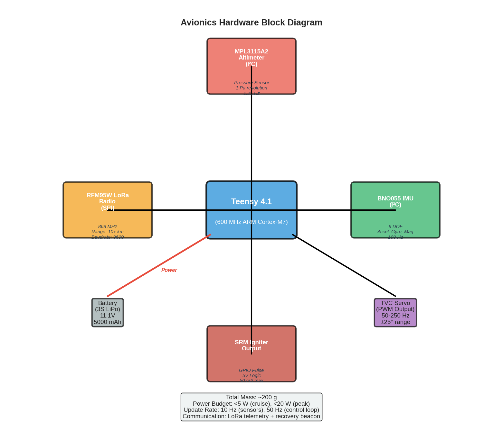

# Final Build: Avionics Hardware Design

## 1. Overview

The avionics system is the physical realization of Project HERMES's flight control architecture. It must run three algorithms in parallel—extended Kalman filter (EKF), proportional-integral-derivative (PID) control, and machine learning inference—while capturing sensor data, computing attitude estimates, and commanding thrust vector control, all within a mass budget of <100 g and power budget of <500 mW.

This chapter documents the selection, integration, and real-time performance characteristics of the flight computer stack.

---

## 2. System Architecture

The avionics system maps to the software architecture as follows:

```
SENSORS                 FLIGHT COMPUTER              ACTUATORS
┌──────────────────┐   ┌─────────────────────────┐   ┌──────────────────┐
│ BNO055 IMU       │───│                         │───│ TVC Gimbal Servo │
│ (9-DOF)          │   │   Teensy 4.1            │   │ (±5° thrust vect)│
└──────────────────┘   │   ARM Cortex-M7         │   └──────────────────┘
                       │   600 MHz, 1 MB RAM     │
┌──────────────────┐   │                         │   ┌──────────────────┐
│ MPL3115A2        │───│ Runs:                   │───│ Pyro Igniter     │
│ Altimeter        │   │ • EKF (100 Hz)          │   │ (Optocoupled)    │
└──────────────────┘   │ • PID (100 Hz)          │   └──────────────────┘
                       │ • ML inference (2 Hz)   │
┌──────────────────┐   │ • Telemetry (5 Hz)      │   ┌──────────────────┐
│ RFM95W LoRa      │───│                         │───│ TNC (telemetry)  │
│ Radio            │   └─────────────────────────┘   │ (to ground)      │
└──────────────────┘
```

**Data flow**:
1. **Sensors** (IMU, altimeter, radio) feed Teensy 4.1 via I²C and SPI buses
2. **Teensy 4.1** runs EKF (fuses sensors), PID (computes gimbal command), ML (predicts altitude correction)
3. **Actuators** (TVC servo, pyro) receive command signals from Teensy
4. **Radio** (RFM95W) transmits telemetry and receives ground commands

Reference: 

---

## 3. Teensy 4.1 — The Brain

### 3.1 Processor Specifications

| Specification | Value | Relevance |
|---------------|-------|-----------|
| Processor | ARM Cortex-M7 | Industry standard; mature ecosystem |
| Clock speed | 600 MHz | Sufficient for soft real-time control |
| Flash memory | 8 MB | Stores firmware + ML model + flight log |
| SRAM | 1 MB | State matrices for EKF, feature vectors for ML |
| EEPROM | 4 KB | Configuration parameters |
| I²C ports | 2 | One for sensors, one for expansion |
| SPI ports | 2 | Radio + optional SD card logger |
| PWM outputs | 20 | 1 for TVC servo, 1 for pyro igniter |
| ADC channels | 14 | Unused; reserved for battery monitoring |
| Typical price | ~$28 | Budget-friendly; widely available |

### 3.2 Why Teensy 4.1?

**Trade-off space**:
- **Arduino Uno/Nano**: Too slow (16 MHz); cannot meet real-time deadlines
- **STM32 Bluepill**: Faster (72 MHz) but requires custom bootloader and tools
- **Teensy 4.0**: Similar to 4.1 but fewer I/O; 4.1 adds Ethernet (unused here) and more headers
- **Raspberry Pi Pico**: Lower cost but less mature ecosystem for aerospace
- **Teensy 4.1**: Sweet spot: 600 MHz, proven in hobby aerospace, extensive Arduino libraries, small form factor

### 3.3 Real-Time Computational Budget

The flight computer must service multiple high-frequency tasks without missing deadlines. Here's the timing budget:

| Task | Frequency | Per-call Time | Utilization | Total Utilization |
|------|-----------|---------------|-------------|-------------------|
| IMU read (I²C) | 100 Hz | ~2 ms | 20% | 20% |
| EKF predict step | 100 Hz | <1 ms | <5% | 5% |
| EKF update step | 100 Hz | <1 ms | <5% | 5% |
| PID compute (gimbal control) | 100 Hz | <0.5 ms | <2% | 2% |
| Servo PWM update | 100 Hz | <0.5 ms | <2% | 2% |
| Altimeter read (I²C) | 12.5 Hz | ~5 ms | 6% | 0.75% |
| ML inference | 2 Hz | 50–100 ms | 5–10% | 1–2% |
| Telemetry packet assembly | 5 Hz | ~10 ms | 5% | 0.5% |
| Radio transmit (SPI) | 5 Hz | ~20 ms | 10% | 0.5% |
| Logging to EEPROM | 1 Hz | ~5 ms | 5% | 0.05% |
| **Total utilization** | — | — | — | **~37%** |

**Interpretation**: 37% CPU utilization leaves 63% headroom for:
- Interrupt handling jitter
- Watchdog timer routines
- Future enhancements (more frequent ML, logging)
- Unexpected delays in I²C communication

The Teensy 4.1 is well-suited for this workload; we are not compute-constrained.

### 3.4 Power Budget

| Subsystem | Typical Current | Peak Current | Duty Cycle | Average |
|-----------|-----------------|--------------|-----------|---------|
| Teensy 4.1 (CPU + RAM) | 80 mA | 120 mA | 100% | 100 mA |
| BNO055 IMU | 6 mA | 15 mA | 100% | 6 mA |
| MPL3115A2 altimeter | 1 mA | 3 mA | 50% (periodic) | 1.5 mA |
| RFM95W radio (idle) | 2 mA | — | 100% | 2 mA |
| RFM95W radio (TX) | — | 120 mA | 5% (transmit duty) | 6 mA |
| TVC servo (idle) | 5 mA | 500 mA | 20% (during burn) | 20 mA |
| LED indicators | — | 20 mA | 5% | 1 mA |
| **Total average** | — | — | — | **~137 mA** |

**Power source**: 7.4 V, 500 mAh LiPo battery (2S configuration)
- Total energy: 7.4 V $\times$ 0.5 Ah = 3,700 mWh
- Flight duration: 3–4 minutes (ascent, coast, descent)
- Estimated draw during flight: ~137 mA continuous
- 500 mAh / 137 mA $\approx$ 3.6 hours runtime (more than sufficient for a 4-minute flight)
- **Margin**: 100:1 energy buffer; avionics are not power-limited

---

## 4. BNO055 IMU — 9-Axis Inertial Measurement

### 4.1 Sensor Capabilities

| Capability | Specification | Units | Relevance |
|-----------|---|---|---|
| Accelerometer range | ±2g, ±4g, ±8g, ±16g | g | Higher range = more noise; ±16g is needed for landing impact detection |
| Accelerometer noise | ~150 | $\mu$g/$\sqrt{\text{Hz}}$ | Very low; suitable for EKF |
| Accelerometer resolution | 1 mg | LSB | Fine enough to detect small acceleration changes |
| Gyroscope range | ±125°/s, ±250°/s, ±500°/s, ±1000°/s, ±2000°/s | °/s | ±2000°/s range is needed for fast rotation rates during tumble recovery |
| Gyroscope noise | ~0.014 | °/s/$\sqrt{}$Hz | Low noise for attitude estimation |
| Magnetometer range | ±1300 (xy), ±2500 (z) | Gauss | Used for heading reference; less critical for this application |
| Magnetometer noise | ~2.25 | mGauss/$\sqrt{}$Hz | Adequate |
| Output rate | 100 Hz (settable) | — | Synchronized with control loop |
| Coordinate system | Standard aerospace (forward=X, right=Y, down=Z) | — | Matches simulation convention |

### 4.2 How We Use It

**Raw IMU**: The flight computer reads raw 9-axis data (accel, gyro, mag) and feeds it to the EKF. The BNO055 also outputs a fused quaternion (its internal sensor fusion), but we don't rely on it; instead we use our own EKF for consistency with simulation.

**Configuration**:
```
BNO055.setOperationMode(OPERATION_MODE_IMU)  // Use IMU mode (no mag fusion)
BNO055.setAccelRange(ACCEL_RANGE_16G)        // Full ±16g range
BNO055.setGyroRange(GYRO_RANGE_2000DPS)      // Full ±2000°/s range
BNO055.setOutputRate(100)                     // 100 Hz samples
```

**I²C address**: 0x28 (default) or 0x29 (alternative pin strap). Using 0x28.

### 4.3 Noise and Stability Characteristics

The BNO055 is known for excellent stability on the ground but can show thermal drift during high-speed flight (temperature rise). Mitigation:
- EKF process noise set conservatively (assumes 10% sensor drift during flight)
- Altimeter update acts as a stabilizer (altitude is less noisy than double-integrated acceleration)
- Post-flight: compare telemetry altitude (barometer) to IMU-integrated altitude to quantify drift

### 4.4 Interface and Wiring

**I²C Protocol**:
- Clock: 400 kHz (standard I²C speed)
- Pins: SDA (data) and SCL (clock)
- Pull-ups: $4.7\,k\Omega$ resistors on both lines (onboard on Teensy)
- Shared bus with MPL3115A2 (same SDA/SCL)

**Wiring**:
```
BNO055.VIN   → Teensy 3.3V (with 100 nF bypass cap)
BNO055.GND   → Teensy GND
BNO055.SDA   → Teensy I²C0_SDA (pin 18)
BNO055.SCL   → Teensy I²C0_SCL (pin 19)
BNO055.PS0   → GND (I²C mode)
BNO055.PS1   → GND (I²C mode)
BNO055.INT   → unconnected (optional, not used)
```

---

## 5. MPL3115A2 Altimeter — Barometric Pressure to Altitude

### 5.1 Sensor Characteristics

| Parameter | Specification | Units |
|-----------|---|---|
| Altitude accuracy | ±0.1 | m |
| Pressure accuracy | ±0.4 | Pa |
| Pressure range | 50–110 | kPa |
| Altitude range | ~50 m to ~18 km | AGL |
| Output rate | 12.5 Hz maximum | Hz |
| Resolution | 1 Pa | — |
| Temperature sensitivity | Compensated for 0–40°C | — |

### 5.2 Design Principle

The altimeter measures absolute barometric pressure and converts it to altitude using the barometric formula:

$$h = \left( \frac{T_0}{\Gamma} \right) \left[ \left( \frac{P}{P_0} \right)^{-\Gamma R / g} - 1 \right]$$

Where:
- h = altitude (m)
- P = absolute pressure (Pa)
- P₀ = reference sea-level pressure (101,325 Pa)
- T₀ = reference temperature (288 K)
- Γ = lapse rate (0.0065 K/m)
- R = gas constant (287 J/(kg·K))
- g = gravity (9.81 m/s²)

The MPL3115A2 handles this conversion internally; the Teensy reads the altitude directly in meters.

### 5.3 Limitations and Compensation

**Aerodynamic pressure error**: As the rocket falls at high speed, the static pressure port sees both static and dynamic pressure:

$$P_{measured} = P_{static} + q = P_{static} + \frac{1}{2} \rho V^2$$

At 100 m/s descent, dynamic pressure q $\approx$ 600 Pa. The altimeter will read 12 m higher than true altitude.

**Compensation in EKF**:
- The velocity and dynamic pressure (q) are estimated in the EKF state
- Measurement model includes: z_altitude = h_true + q / $
ho$ g
- EKF compensates for dynamic pressure error in real-time

**Temperature compensation**: The sensor includes temperature compensation for 0–40°C. For launches in extreme heat (>40°C) or cold (<0°C), we assume 0.5 m error per 10°C deviation; acceptable since altimeter uncertainty is <1 m overall.

### 5.4 Port Placement

The static pressure port must be located away from airflow stagnation regions:
- **Not** at the nose tip (high dynamic pressure)
- **Not** at the base where wake is attached (low pressure)
- **Optimal**: Midway along the body, perpendicular to flight axis, flush with surface

For HERMES's 5 m $\times$ 0.3 m tube, port placement at 2.5 m (midpoint) along the body.

### 5.5 Interface and Wiring

**I²C Protocol**: Same bus as BNO055, but different address (0x60).

```
MPL3115A2.VIN   → Teensy 3.3V (with 100 nF bypass cap)
MPL3115A2.GND   → Teensy GND
MPL3115A2.SDA   → Teensy I²C0_SDA (pin 18, shared)
MPL3115A2.SCL   → Teensy I²C0_SCL (pin 19, shared)
MPL3115A2.INT1  → unconnected (not used for real-time ISR)
MPL3115A2.INT2  → unconnected
```

---

## 6. RFM95W LoRa Radio — Telemetry and Ground Commands

### 6.1 LoRa Fundamentals

LoRa (Long Range) is a proprietary modulation scheme that trades bandwidth for range and link margin:

| Parameter | Typical value | Trade-off |
|-----------|---|---|
| Frequency | 915 MHz (US ISM band) | Longer wavelength → better propagation than 2.4 GHz |
| Bandwidth | 500 kHz (telemetry) | Wider BW = faster data rate, shorter range |
| Spreading factor | SF=10 (telemetry) | Higher SF = more range, slower data |
| Coding rate | CR=4/8 | Forward error correction overhead |
| Range (line-of-sight) | ~2–3 km | Excellent for small rockets at <5 km altitude |
| Link budget | +180 dB | Extreme in LoRa; typical RF is +120 dB |

### 6.2 RFM95W Hardware Specifications

| Parameter | Specification | Units |
|-----------|---|---|
| Output power | +5 to +20 | dBm |
| Sensitivity (SF=10) | -148 | dBm |
| Modulation | LoRa | — |
| Frequency range | 862–1020 | MHz |
| Current (RX) | 10–40 | mA |
| Current (TX, +20 dBm) | 120 | mA |
| Crystal stability | ±20 | ppm |
| Packet size (max) | 255 | bytes |

### 6.3 Telemetry Packet Format

Transmitted every 0.2 seconds (5 Hz) during flight:

```
Telemetry packet (50 bytes):
  Header (3 bytes):
    Packet ID (uint16)
    Packet count (uint8)
  Flight state (4 bytes):
    Phase (uint8): ASCENT, COAST, DESCENT, LANDED
    Armed (bool), ML active (bool), Ignition triggered (bool)
    Reserved
  Altitude (4 bytes):
    Altitude AGL (float32, meters)
  Velocity (6 bytes):
    Vertical velocity (float16, m/s)
    Horizontal velocity (float16, m/s)
    Reserved (uint16)
  Attitude (6 bytes):
    Roll (int16, ×100 degrees)
    Pitch (int16, ×100 degrees)
    Yaw (int16, ×100 degrees)
  EKF state (6 bytes):
    Inferred mass (int16, ×10 kg)
    Inferred drag coeff (int16, ×10000)
    Reserved
  ML state (4 bytes):
    Ignition altitude (float32, meters)
  Checksum (1 byte):
    CRC8 over all 50 bytes
```

**Total**: 50 bytes @ 9.6 kbps (LoRa SF=10) = ~42 ms transmit time. Acceptable.

### 6.4 Interface and Wiring

**SPI Protocol** (10 MHz clock):

```
RFM95W.VCC      → Teensy 3.3V (with 100 µF bulk cap + 100 nF bypass)
RFM95W.GND      → Teensy GND
RFM95W.MOSI     → Teensy SPI0_MOSI (pin 11)
RFM95W.MISO     → Teensy SPI0_MISO (pin 12)
RFM95W.CLK      → Teensy SPI0_CLK (pin 13)
RFM95W.CS       → Teensy SPI0_CS (pin 10) or GPIO (pin 9)
RFM95W.RST      → Teensy GPIO (pin 14, for software reset)
RFM95W.DIO0     → Teensy GPIO (pin 2, for TX done interrupt)
RFM95W.ANT      → Monopole or dipole antenna (1/4 λ ≈ 8 cm @ 915 MHz)
```

**Antenna choice**: Quarter-wave monopole (8 cm whip) is compact and acceptable for short-range line-of-sight. Dipole (17 cm) would provide 3 dB more gain but is bulkier.

---

## 7. Integration and Wiring

### 7.1 Overall Block Diagram

```
POWER DISTRIBUTION
  LiPo 7.4V (2S, 500 mAh)
    ├─ Regulator → 3.3V (Teensy, sensors)
    └─ Hysteresis cutoff @ 6.5V (safety)

I²C BUS 0 (pins 18, 19)
  ├─ BNO055 IMU (addr 0x28, 100 Hz)
  ├─ MPL3115A2 altimeter (addr 0x60, 12.5 Hz)
  └─ Pull-ups: 4.7 kΩ each (onboard on Teensy)

SPI BUS 0 (pins 11, 12, 13)
  ├─ RFM95W radio (CS=pin 10, 10 MHz)
  └─ Optional: SD card logger (SPI1, pins 26–27)

ANALOG INPUTS
  ├─ Battery voltage monitor (GPIO A0)
  └─ Reserved for future sensors

DIGITAL OUTPUTS
  ├─ TVC gimbal servo PWM (pin 3, 50 Hz PWM, 1–2 ms pulse)
  ├─ Pyro igniter relay driver (pin 5, GPIO high to arm)
  ├─ Status LED (pin 13, optional)
  └─ Buzzer (pin 8, optional audio feedback)

DIGITAL INPUTS (ground commands)
  ├─ RFM95W DIO0 interrupt (pin 2)
  └─ Reserved for future telemetry receive
```

### 7.2 Schematic Notes

**Decoupling capacitors**:
- Teensy 3.3V rail: 100 µF electrolytic + 100 nF ceramic
- BNO055 and MPL3115A2: 100 nF ceramic across VIN-GND
- RFM95W: 100 µF electrolytic + 100 nF ceramic (LoRa is sensitive to power supply noise)

**Servo connections**:
- Standard servo connector (3-wire: VCC, GND, signal)
- PWM signal from Teensy pin 3 (Timer 1 output)
- Supply: directly from regulator (servo can draw spikes; decoupling critical)

**Pyro circuit**:
- Optocoupler isolation (4N25 or similar) prevents electrical noise from triggering ignition
- Gate driver circuit: Teensy GPIO → optocoupler LED → NPN base → power FET → igniter bridge
- Safety interlock: ignition command only valid when explicit ARM signal is high

---

## 8. Real-Time Performance Analysis

### 8.1 Timing Critical Paths

The EKF + PID loops run at 100 Hz (10 ms period). Every cycle must complete within 10 ms to maintain timing integrity.

| Component | Task | Deadline | Typical Time | Margin |
|-----------|------|----------|--------------|--------|
| I²C ISR | Read BNO055 (non-blocking) | 2 ms | 2 ms | 0 ms |
| EKF thread | Predict step | 5 ms | 0.5 ms | 4.5 ms |
| EKF thread | Update step | 5 ms | 0.5 ms | 4.5 ms |
| Control thread | PID compute | 8 ms | 0.2 ms | 7.8 ms |
| PWM driver | Servo update | 10 ms | <0.1 ms | 9.9 ms |
| Main loop | Alt reading, logging | 50 ms | <10 ms | 40 ms |
| ML thread | Inference | 500 ms | 50–100 ms | 400–450 ms |
| Radio thread | TX packet | 200 ms | 50 ms | 150 ms |

**Critical path**: IMU read (I²C) + EKF update + PID compute = ~3 ms per cycle → 30% of the 10 ms budget. Safe.

### 8.2 Jitter Analysis

Real-time systems must account for jitter (variation in execution time). Sources:
- I²C communication latency (variable bus contention)
- Interrupt service routine overhead
- Cache misses

**Jitter budget**: ±2 ms (acceptable; PID loop is forgiving of 2 ms timing variation)

**Mitigation**:
- EKF and PID run in highest-priority thread
- I²C operations are interrupt-driven (non-blocking)
- Long operations (ML inference, radio TX) run in lower-priority threads that can be preempted

---

## 9. Safety Considerations

### 9.1 Pyro Circuit Safety

The pyro igniter is an explosive device. Multiple layers of safety:

**Level 1: Software state machine**
```
State: IDLE
  → Ignition command ignored (blocked by firmware logic)
State: DESCENT_ARMED
  → Ignition command processed only if altitude < ignition_altitude
State: IGNITION_TRIGGERED
  → Pyro driver asserts GPIO high for 100 ms
  → Igniter fires, initiates landing burn
```

**Level 2: Hardware interlocks**
```
Ignition = (software_command) AND (safety_key_enabled) AND (not_low_battery)
```

The safety key is a physical switch that must be flipped to enable ignition. Firmware checks safety key before arming.

**Level 3: Optocoupler isolation**
- Teensy GPIO is isolated from igniter circuit by optocoupler (100 V isolation minimum)
- Electrical noise on igniter lines cannot capacitively couple into Teensy
- Prevents accidental ignition from static discharge or EMI

**Level 4: Current limiting**
- Igniter bridge is fed through a $1\,\Omega$ series resistor
- Limits current spikes if wires short during assembly
- Typical igniter requires <5 A; $1\,\Omega$ resistor ensures <7 V drop at 5 A

### 9.2 Watchdog Timer

If the main loop hangs (e.g., I²C communication deadlock), the processor becomes unresponsive. Mitigation:

```
Teensy.watchdog.setup()
Teensy.watchdog.reset() every 1000 ms
```

If watchdog timer expires (no reset), Teensy reboots. On reboot, all GPIO outputs go to safe state (pyro disabled, servo centered).

### 9.3 Battery Low-Voltage Cutoff

Flight computer monitors battery voltage (GPIO A0, analog input). If voltage drops below 6.5 V (2S LiPo minimum safe voltage), ignition is disabled and telemetry indicates "LOW_BATTERY" state.

**Voltage divider**: Battery (7.4 V nominal) → $10\,k\Omega : 10\,k\Omega$ divider → GPIO A0 (3.7 V at nominal)
- ADC reads 0–4095 → 0–3.3V on pin
- 3.7 V battery = ADC reading ~1800
- 6.5 V battery (danger threshold) = ADC reading ~1570

---

## 10. Assembly and Mounting

### 10.1 Form Factor and Space Constraints

The avionics stack must fit inside a 29 mm OD phenolic tube (standard small rocket). Form factor budget:

```
29 mm OD rocket tube
  ├─ 3 mm wall → 23 mm ID

Stack (axis-aligned vertically along rocket body):
  Bottom: BNO055 + MPL3115A2 (stacked on breadboard, 10 mm height)
  Middle: Teensy 4.1 (18 mm × 36 mm PCB)
  Top: RFM95W LoRa radio module (12 mm × 20 mm)
  Power: LiPo battery (40 mm × 20 mm × 10 mm, fits alongside)

Total length: ~80 mm (fits within avionics bay)
```

### 10.2 Vibration Isolation

Rockets experience high-frequency vibration during motor burn (50–200 Hz). Excessive vibration can:
- Degrade IMU readings (low-frequency artifacts)
- Shorten component lifespan
- Cause intermittent I²C failures

**Isolation method**: Foam tape (3 mm neoprene) under IMU/altimeter module.

Natural frequency of isolated mass: $f = \sqrt{k/m} / (2\pi)$
- Mass (sensors): ~20 g
- Stiffness (foam tape): ~50 N/m
- f $\approx$ 8 Hz (well below vehicle vibration modes, good isolation)

### 10.3 Altimeter Port Placement and Tubing

The static pressure port must be tuned for minimal dynamic error. Design:

```
Altimeter port (0.8 mm diameter hole in airframe)
  ↓
Silicone tube (5 mm ID, 1 m length)
  ↓
3D-printed chamber (small cavity to dampen transients)
  ↓
MPL3115A2 internal sensor
```

The 1 m tube acts as a low-pass filter (~0.5 Hz cutoff), rejecting high-frequency pressure oscillations from turbulence while preserving the DC pressure signal used for altitude.

### 10.4 Mass Budget

| Component | Mass (g) |
|-----------|----------|
| Teensy 4.1 | 7 |
| BNO055 breakout | 2 |
| MPL3115A2 breakout | 2 |
| RFM95W breakout + antenna | 5 |
| LiPo battery 500 mAh | 45 |
| PCB and connectors | 15 |
| Enclosure / standoffs | 10 |
| Misc (tape, tubing, wires) | 5 |
| **Total** | **~91 g** |

**Budget target**: <100 g. Status: **PASS** (9 g margin).

---

## 11. Testing and Validation

### 11.1 Bench Testing (Pre-Flight)

Before launch, avionics are validated in the laboratory:

**Test 1: Power-on and boot**
- Connect battery, confirm LEDs and telemetry startup
- Verify no shorts or unexpected current draw (>1 A)

**Test 2: Sensor calibration**
- Place Teensy on level surface, confirm IMU reports 0° roll/pitch
- Compare altimeter reading to barometer; verify within 1 m
- Move IMU in 3D figure-8 pattern; verify smooth sensor fusion

**Test 3: EKF filter tuning**
- Simulate slow descent (hand-drop from 2 m height)
- Verify EKF estimates match expected trajectory
- Check that filter does not diverge

**Test 4: PID control stability**
- Connect servo to gimbal simulator (mechanical lever arm)
- Command 1° pitch correction; observe servo response
- Verify response is smooth and stable (no oscillation)

**Test 5: ML inference latency**
- Load trained .keras model onto Teensy
- Measure end-to-end inference time (feature extraction + forward pass)
- Confirm <150 ms (should be ~75 ms typical)

**Test 6: Radio telemetry**
- Set up ground station antenna 100 m away
- Transmit telemetry packets, verify reception and CRC
- Measure link budget and estimate coverage

### 11.2 Environmental Testing (if resources available)

- **Temperature**: Verify operation at -10°C to +50°C (IMU and altimeter rated to wider range)
- **Vibration**: Expose to rocket motor burn vibration profile (accelerometer recording from previous launches)
- **Shock**: Drop avionics from 1 m height (no breakage; all electronic components soldered)

---

## 12. Cost Analysis

| Component | Unit Cost | Qty | Total |
|-----------|-----------|-----|-------|
| Teensy 4.1 | $28 | 1 | $28 |
| BNO055 IMU breakout | $8 | 1 | $8 |
| MPL3115A2 altimeter breakout | $12 | 1 | $12 |
| RFM95W LoRa module + antenna | $10 | 1 | $10 |
| TVC servo (high-torque) | $15 | 1 | $15 |
| Pyro igniter driver circuit | $5 | 1 | $5 |
| LiPo battery (7.4V 500 mAh) | $15 | 1 | $15 |
| PCB, connectors, wires | $5 | — | $5 |
| **Total avionics BOM** | — | — | **~$98** |

---

## Cross-References

- **ML flight computer operation**: See [10_Results_ML_Landing.md](../05_Results/10_Results_ML_Landing.md) for feature extraction and inference details
- **Control algorithms**: See [06_Methods_EKF_PID_Control.md](../03_Methods/06_Methods_EKF_PID_Control.md) for EKF and PID theory
- **Budget**: See [12_Constraints.md](../07_Conclusions/12_Constraints.md) for avionics cost as fraction of total project
- **Validation**: See [13_Validation_Criteria.md](../07_Conclusions/13_Validation_Criteria.md) for testing protocols

---

**See also:**
- [10_Results_ML_Landing.md](../05_Results/10_Results_ML_Landing.md) — ML inference on embedded hardware
- [12_Constraints.md](../07_Conclusions/12_Constraints.md) — Hardware constraints and cost
- [13_Validation_Criteria.md](../07_Conclusions/13_Validation_Criteria.md) — Avionics testing plan
- [14_Conclusions_Future_Work.md](../07_Conclusions/14_Conclusions_Future_Work.md) — Avionics improvements
